## A brief introduction to Google Earth Engine

Google Earth Engine (GEE) is an online Integrated Development
Environment (IDE) for rapid development and visualization of complex
spatial analyses using the JavaScript or Phyton coding languages,
allowing users to conduct data heavy analysis. While computer coding can
sound challenging for ecologists, researchers, students or managers that
have never used code before, it is rather simple and opens the spectrum
of data analysis enormously. The integrated platform that Google Earth
Engine provides allows not only traditional remote sensing scientists,
but also a much broader spectrum of users to run spatial analysis,
without the need to have deep expertise on the use of supercomputers.

The GEE platform has the main advantage of providing access to:

1.  Petabytes of remote sensing imagery and other spatial products;

2.  High-speed parallel processing and machine learning algorithms;

3.  A library of Application Programming Interfaces (APIs) with
    development environments

These three features enable the user to visualize and analyze a bast
range of geospatial data fast and for free, without the need to access a
supercomputers (Gorelick et al., 2017).

Google Earth Engine Application Programming Interface (API) can be run
in popular coding languages, such as JavaScript and Phyton. In this tutorial
we will focus on the use of JavaScript. In this first section we will
explore the basics of Google Earth Engine, from understanding how to set
up an account, to understand the interface to explaining the basics of
JavaScript coding language.

### Setting up a Google Earth Engine account:

The first step to start using Google Earth Engine is to set up a Google Cloud project. In this [link](https://console.cloud.google.com/earth-engine/welcome?inv=1&invt=Ab42LQ) you will find the instructions. If you are working in research or for non-profit organizations, you can register a free or charge non-commercial project. 

### The Google Earth Engine Interface

Once your Google Earth Engine account is set, you will be able to aces
the Code Editor to start working on it in your browser at
<https://code.earthengine.google.com/>.

The Google Earth Engine interface is an interactive web-based
environment for data analysis. It has four main panels (Fig. 1):

1.  The `Code Editor panel` to write JavaScript code.

2.  The `Left panel` for managing and hosting programming scripts,
    accessing Google Earth Engine documents and managing and uploading
    external data sets such as shapefiles.

3.  The `Right panel` with tabs for printing, queering maps and
    exporting products or long-running tasks.

4.  The `Interactive map panel` for visualizing maps and outputs.

Additionally, on top of the interface is the `search tab`, that allows
you to search and find data sets and places. At the top right is a
`help menu` that links to a user guide, help forum and other types of
support (Fig. 1).

<center>

<figure>
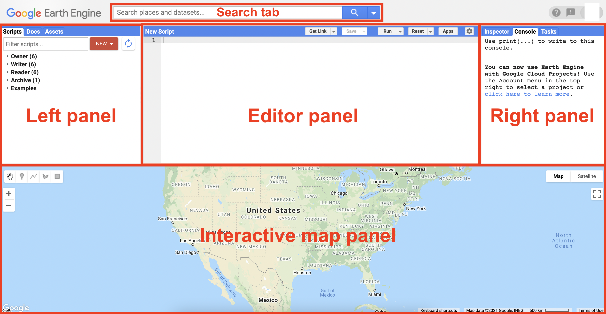
<figcaption aria-hidden="true">Figure 1. Google Earth Engine is a
web-based environment that consists on four main panels.</figcaption>
</figure>

</center>

Each main panel has a variety of elements that will explore more in
detail (Fig. 2). Among this are:

1.  The **Docs tab** or documentation tab

2.  The **Scripts tab** or Git-based Script Manager

3.  The **Assets tab** or asset manager

4.  The **search bar**

5.  Several buttons in the script panel to **save**, **run** and manage
    scripts

6.  The **Inspector tab** or interactive map query

7.  The **Console tab**

8.  The **Tasks tab**

9.  **Geometry drawing tools** in the interactive map panel

<center>

<figure>
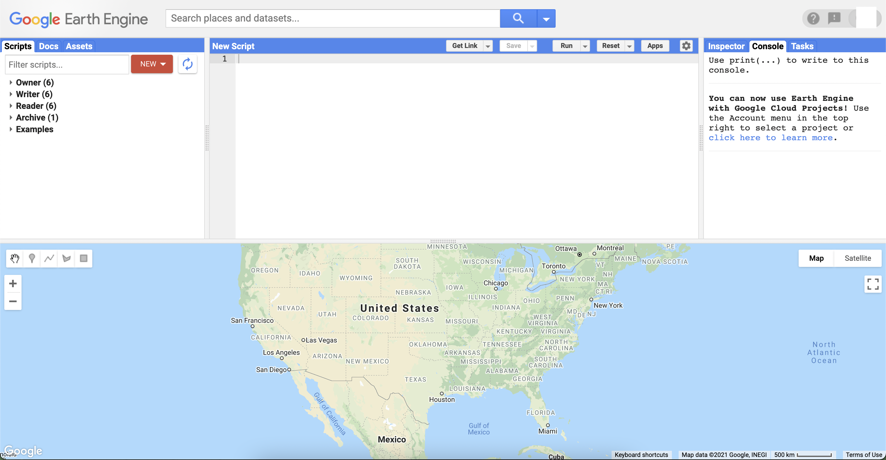
<figcaption aria-hidden="true">Figure 2. Google Earth Engine web-based
environment.</figcaption>
</figure>

</center>

Let’s explore the different panels and elements more in detail.

#### The code editor panel

The **code editor panel** is the area where you will write the
JavaScript code to perform all type of analysis. Above the code editor
panel are buttons to save your current script, run it, and clear the
script. The **Get Link button** (Fig. 3) generates a unique URL for the
script in the address bar that allows you to share the script and/or
open it in a new browser tab. This is a unique characteristic of GEE
that allows you to share your work and make it reproducible by any other
user with a GEE account.

<center>

<figure>
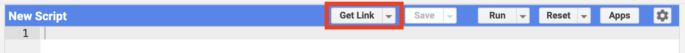
<figcaption aria-hidden="true">Figure 3. The “Get Link”
button.</figcaption>
</figure>

</center>

The **drop-down button** at the right of the **Get Link button** has the
option to “Manage Links.” Clicking this button opens a new tab that
allows you to access, remove and download previously generated script
links. If you choose to download the script, this will be saved to your
personal computer as a zipped folder containing a .txt file with the
code.

Next to the **Get Link button** is the **Save button**. This button
allows you to save the script as a new script and subsequent updates.

Next is the **Run button** that allows you to run the script. The
**drop-down button** allows you to run the script with profiler (See
Profiler tab below).

To the right, the **Reset button** will reset all tabs on the right
panel. The **drop-down button** will allow you to clear the script to
start a new one.

Next is the **Apps button**. This opens the App window display that we
will explore later on the tutorial.

Finally, there is a **Settings button** that allows you to activate
options to underline code suggestions and to auto-complete pairs such as
quotation marks, parentheses and brackets. You can activate or
deactivate these two options depending on your coding preferences.

#### The left pannel

##### The Docs tab – API reference

The **Docs tab** (Fig. 4) contains the entire JavaScript API
documentation developed by Google. Here, you will find all the
information necessary to understand functions. We recommend you to get
familiar with this tab as it gets really useful for writing scripts and
running more complicated analysis. You can use the search tab to filter
methods and find specific functions.

<center>

<figure>
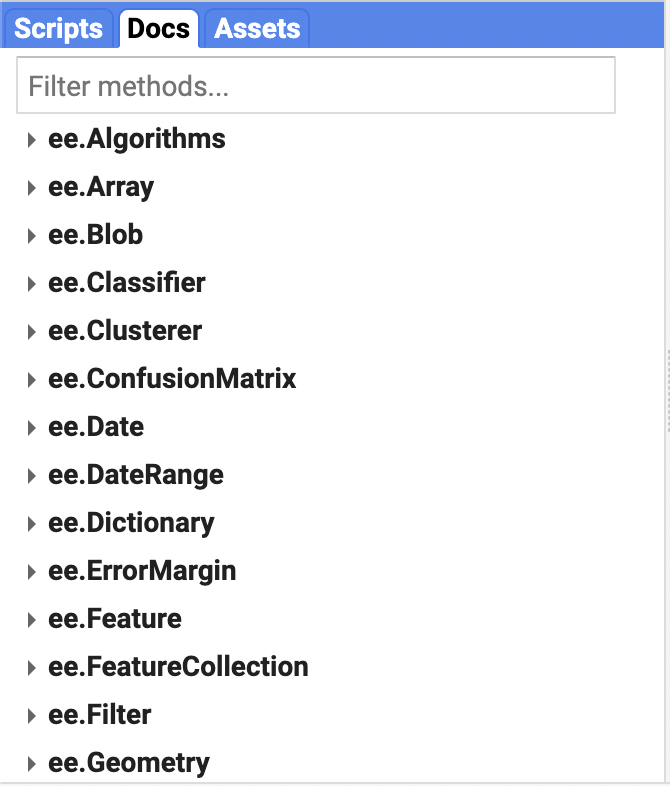
<figcaption aria-hidden="true">Figure 4. The Docs tab.</figcaption>
</figure>

</center>

When clicking on any build in function, you will find a description of
the function, the arguments that the function takes, and the what the
function returns.

##### The Scripts tab – Script manager

The **Scripts tab** is where private, shared and all script examples
hosted by Google are stored. The **Owner level** stores all your private
scripts, the ones that only you can see and edit. The **Writer level**
stores scripts that has been shared (access granted) with you by another
user. Sharing repositories and scripts can be really useful to work on
collaborative projects. Once someone has added you to a repository, you
can add new scripts, modify existing scripts, and manage access to the
repository for other users. Of course, you can create and share
repositories and scripts with other users. The **Reader level** contains
scripts for which you have read access granted by the script owner, but
you cannot edit the scripts. The **Example level** has script examples
created and managed by Google, that are really good for some basic
operations. Take a look at the scripts available in this folder. The
**Archive level** is for scripts that users have access to read but have
not been migrated by their owner from an older version of the Script
Manager. The search tab allows you to search for scripts within all
these levels.

<center>

<figure>
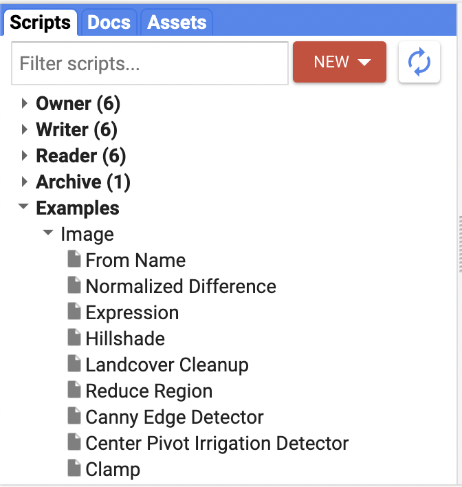
<figcaption aria-hidden="true">Figure 5. The Scripts tab.</figcaption>
</figure>

</center>

The **New button** allows you to create a new repository in the **Owner
folder** or to create folders and files within existing repositories. It
is a good practice to keep your repositories and scripts organized. Give
folders and scripts proper names, something that you will be able to
recognize after several months of not working on them. Your brain can
forget things pretty quick. Once you have created your repositories and
scripts, they can be renamed and deleted by the **Rename and Delete
buttons** that appear at the right on the script while positioning the
pointer on top of the script. Scripts can be dragged and dropped into
new folders or copied into new repositories. The **Revision History
button** allows to compare with previous versions and recover them.
Always important in case that you delete something by mistake.
Similarly, positioning the pointer on top a repository allows to delete
and access the history of the repository. The **Configure button**
allows you to manage access to the repository. As we said before, you
can grant access to other users to your repository. Repositories can be
configured to be accessed using Git, so you can manage and edit your
scripts outside the Code Editor, or sync them with an external system
like Git Hub (Fig. 6).

For this tutorial we have created a repository that you can access in the
reader level.

<center>

<figure>
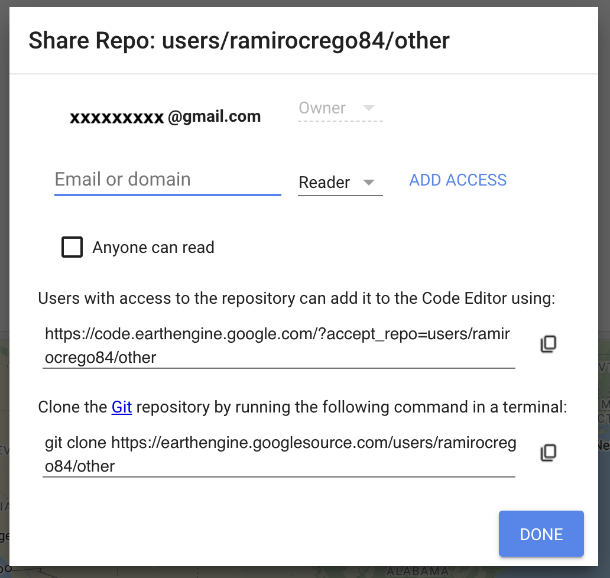
<figcaption aria-hidden="true">Figure 6. You can manage repositories to
share with other users.</figcaption>
</figure>

</center>

##### The Asset tab – Asset manager

The **Asset tab** allows you to upload and manage your own image assets,
shapefiles, and CSV files (Fig. 7). You can click on **NEW** to upload
new assets from your personal computer. We will learn how to do this
with later examples in the following sections. For now, it is good to
get familiarized with the different parts of the interface.

<center>

<figure>
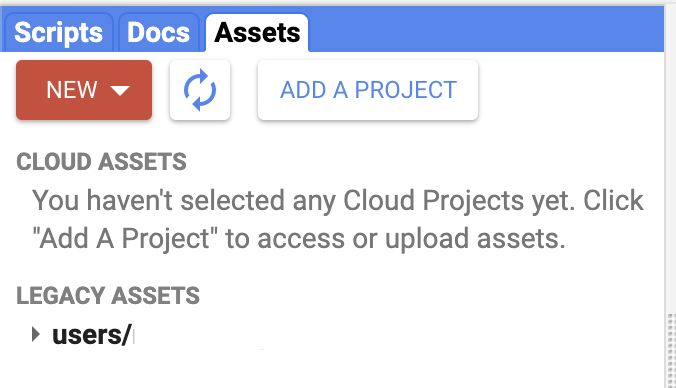
<figcaption aria-hidden="true">Figure 7. The Asset tab.</figcaption>
</figure>

</center>

#### Search bar tool

The **search bar** located in the top of the Code Editor that says
‘Search places and data sets…’ allows you to search the GEE data
archive. Here you can type different keywords of data products, sensors
or places, to filter the data base. If you search for a place, clicking
on the place will make it visible in the map. If you search for a data
product, such as Landsat, you will see a detailed description of each
one. Click **Import** to add the data product into your script as an
import (Fig. 8), which will appear at the top of the script. It is also
possible to import data products using code, so you do not have to
search and click the **Import** button if you want to reuse the script
for another work. Additionally, you can see the JavaScript code to
import any product by clicking on the copy button next to the code and
pasting it into your script. You can delete imports you have added to
your script by positioning your pointer next to the import and clicking
the delete icon.

<center>

<figure>
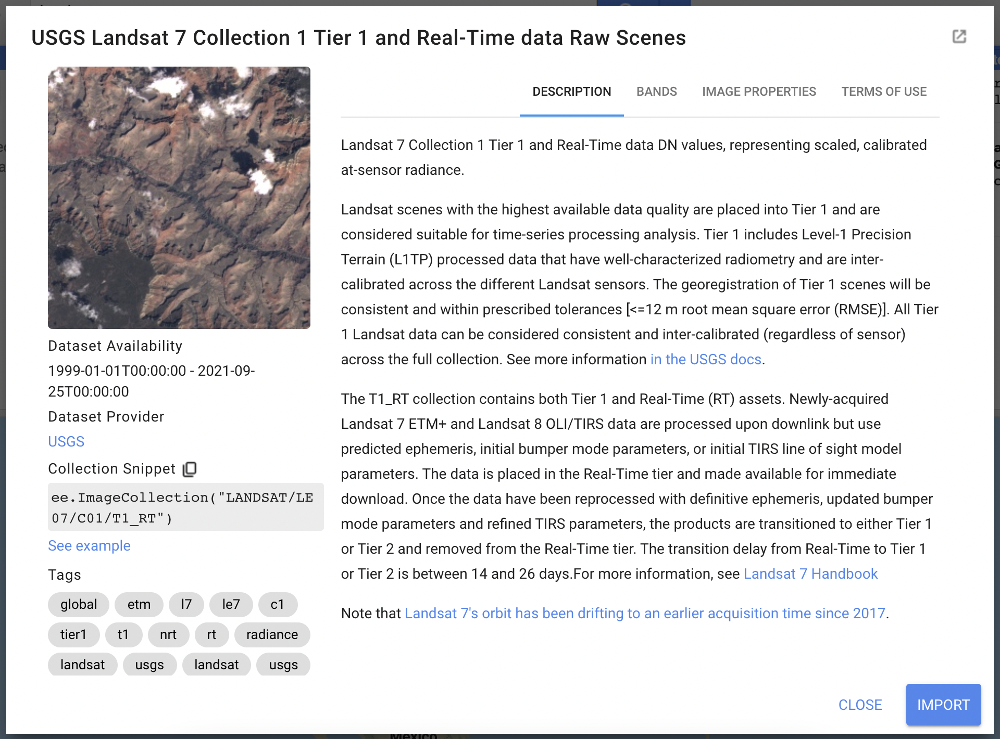
<figcaption aria-hidden="true">Figure 8. Example of product desription
on Google Earth Engine.</figcaption>
</figure>

</center>

#### The right panel

##### Inspector tab

The **inspector tab** allows you to interactively query the different
map layers you have displayed (Fig. 9). When you clicking on the tab,
the pointer becomes a crosshair, meaning the function is activated. You
can click now on any part of the map and the tab will display the
location and values of all layers on the map. This can be useful to
inspect the values of your layers across different locations when
performing an analysis or when inspecting different layers in any area
of interest.

<center>

<figure>
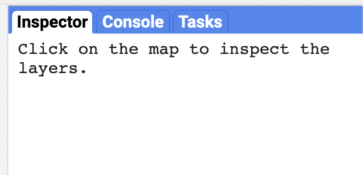
<figcaption aria-hidden="true">Figure 9. The inspector, console and task
tabs.</figcaption>
</figure>

</center>

##### Console tab

The **console tab** is located next to the **inspector tab** (Fig. 9).
This tab is where all the information you print on the code will be
displayed. We will see later how to print information when using
JavaScript. For now, it is enough to remember that this is the tab in
which you will interact with the data and where you can display
information and results from operations. Those can be text, objects or
charts. This console tab is interactive, meaning that you can expand
printed objects to get more details about them. We will start to use
this tab in the next section when you start writing your first
JavaScript code.

##### Tasks tab

The **tasks tab** is located next to the console tab. This tab will
display long running tasks when exporting products from your analyses.
Those could be images or feature collections. Once the export was called
from the code editor, you will need to run it by clicking the run button
next to the exported task. A dialog window will appear, which allows you
to configure your export. Once you have run the task, the status will
display. Tasks can be canceled while running by clicking on the spinning
icon next to the task.

#### Profiler

The **profiler** is a tab that will appear next to the task tab on the
right upper panel when you run the script with the run with profiler
option (or the shortcuts, holding down Alt for PC or Option for Mac, and
clicking run, or pressing Ctrl+Alt+Enter/control+option+return). The tab
displays information about CPU time, memory consumed and other
computation parameters by the algorithms run and the display of all
layers in the map. This can be useful to understand why a script is
running slow or failing due to memory limitations. Not too important at
the beginning, but something to keep in mind for when you start to me
more advanced with Earth Engine analyses. Each row in the profiler tab
corresponds to each algorithm, computation, or asset loaded as described
in the **Description** column. The count column indicates the
proportional number of times the operation was invoked, and the compute
column indicates the CPU time taken by the operation. The **Peak Mem**
column indicates the maximum memory used on any single computation node
for the operation. The **Current Mem** appears only when there is an
error given memory limitation and shows the amount of memory that was in
use on any single compute node when the error occurred.

#### The interactive map panel

##### Layer manager

At the top-right corner of the interactive map panel is the **layer
manager** that allows you to adjust the display of all layers you added
to the map. From here you can activate and deactivate layers display and
adjust its transparency with the slider. By clicking the setting icon,
you can adjust the visualization parameters of each individual layer
(Fig. 10). From here you can customize the stretch of pixel value
display, adjust opacity (transparency), adjust gamma display and change
the color palette. You can manually choose different colors. Click Apply
button to apply the new visualization parameters to the current display.
You can also use the Import button to load the new visualization
parameters object as a new variable in the imports section of your
script that you can use to display other layers on the interactive map.

<center>

<figure>
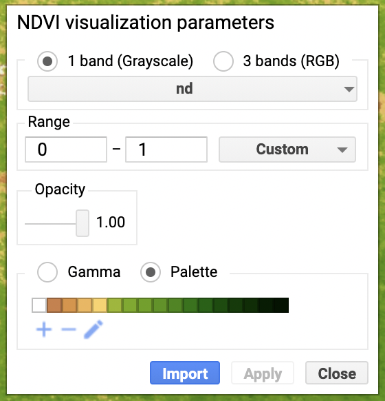
<figcaption aria-hidden="true">Figure 10. Visualization parameters for
layers displayed on the map.</figcaption>
</figure>

</center>

At the right of the **layer manager** are buttons to choose different
map backgrounds: Google street view, terrain view or satellite view with
the option to activate labels. Another icon allows you to get into a
full-screen view.

##### Geometry tools

In addition to images, you can import geometries (i.e., vector data in
Earth Engine language) to your script by drawing them on the map. To
create a geometry, use the **geometry drawing tools** in the upper-left
corner of the interactive map panel. There are four different geometries
you can create: points, lines, polygons, and rectangles. When using the
drawing tool, any geometry created will automatically create a new
geometry layer in the import section of your script. Place the pointer
on the **Geometry Imports** button and then click the **+new layer**
link. Then choose the type of geometry you want to draw and start
clicking on the map to draw your geometries. In the case of polylines
and polygons, double click to finalize the drawing. Geometry display on
the map can be activated and deactivated from the **Geometry Imports**
section. We will learn more about geometries in the second section of
this tutorial. You can delete geometries by activating them using the hand
tool, and pressing **Delete** on your keyboard or by directly clicking
the **delete button** on the **Imports section** of the script.

You can configure the way geometries are imported into the script by
using the settings button that appears when positioning the pointer on
top of the geometry on the **Geometry Imports** section. After clicking
settings, a dialog box will be displayed (Fig. 11). Note that geometries
can be imported as geometries, feature or feature collections and you
can choose on the button that appears on the box. We will learn more
about this in the next section. You can also modify the name and the
color of the layer. Finally, you can click the lock button to lock and
unlock the geometry, what can be useful to prevent edits or deletions by
accident.

<center>

<figure>
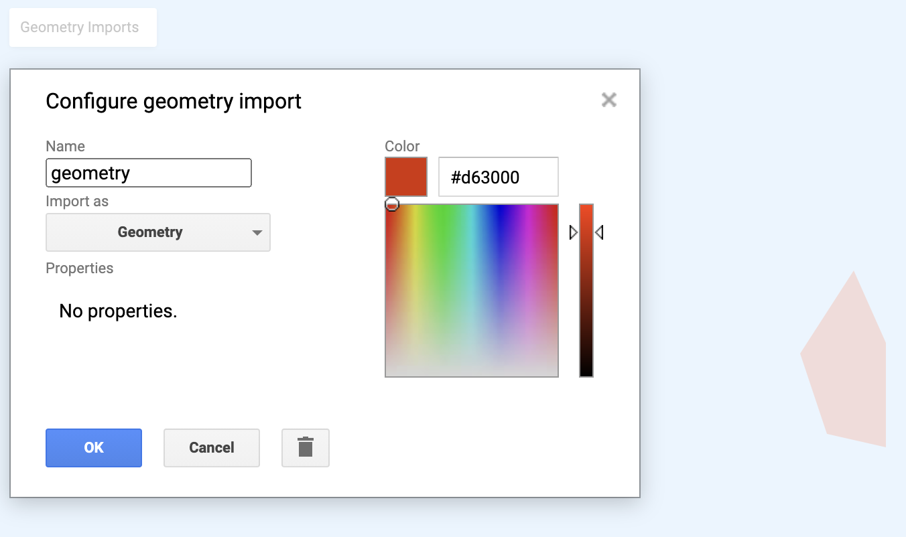
<figcaption aria-hidden="true">Figure 11. Dialog box for
geometries.</figcaption>
</figure>

</center>

#### The help button

On the upper-right corner of your browser window you will find a help
button. When clicking it, you will find links to the developer user
guide with more detail information about all we just covered
([link](https://developers.google.com/earth-engine/guides/getstarted),
and also links to forums where users post questions and help each other.
These forums are of great help and you can post your own questions.
Before posting questions make sure to do a good search as there is a
good chance that someone else encounter a similar problem before and the
answer to your problem is already there.

### The data catalog

One of the most notable features of Google Earth Engine is the enormous
amount of data available to be used. The database consists on about a
petabyte-scale archive of publicly available remotely sensed imagery and
other related data sets. It includes products from the most popular
satellites such as Landsat, MODIS, National Oceanographic and
Atmospheric Administration Advanced Very High Resolution Radiometer
(NOAA AVHRR), Sentinel 1, 2, 3 and 5-P; and Advanced Land Observing
Satellite (ALOS), and other data such as precipitation data, sea surface
temperature data, CHIRPS climate data, topography data, and land cover
data (Gorelick et al., 2017). This database increases daily as new
satellite imagery is taken, processes and uploaded. New products are
also being uploaded frequently. You can explore the data sets at the
following [link](https://developers.google.com/earth-engine/datasets/).

In addition to GEE, there is an online community working collaborating
further to distribute open source data. New products and datasets are
constantly being uploaded and can be find in the following
[link](https://samapriya.github.io/awesome-gee-community-datasets/projects/grip/).
Also, a weekly list of new products updated to GEE can be found in the
following [GitHub
repository](https://github.com/samapriya/Earth-Engine-Datasets-List).

### A brief intro to JavaScript for Google Earth Engine

Now that we have a better understanding of the GEE layout, it is time to
start coding. The API of GEE uses JavaScript coding language. This is an
object-oriented language with first-class functions, and is best known
as the scripting language for Web pages, but it’s used in many
non-browser environments as well. It is a prototype-based,
multi-paradigm scripting language that is dynamic, and supports
object-oriented, imperative, and functional programming styles (xxx).

In this first section we will learn the basics of JavaScript coding.
There are certain code statements that are proper of GEE. We will later
dive into those specifics.

The code on this section can be found [here](https://code.earthengine.google.com/2d5cd3a88c5cf465313f272611056afb)


#### The basics

The code editor panel on the interface is probably the one that you will
use the most. If this is the first time you are facing a coding language
to perform data analysis, the recommendation is to take it slow. As you
get familiarized with the code structure and functions, things will get
easier, we promise.

Let’s start with a simple JavaScript statement. Go to the
[code.earthengine.google.com](code.earthengine.google.com) and type into
the code editor panel:

```{js, eval=F}
print('This is my first code');
```

After, click **Run**. The text ‘This is my first code’ will appear on
the **Console tab**. The parenthesis is used to pass arguments to
functions. Here print is the function that prints the argument on the
console.

In JavaScript, each statement ends in semicolon (But if you do not write
it, the code will run anyway, but it may help you to keep your code
organized). You will learn to write entire analysis that will be
composed of multiple statements like that one.

It is really important that you keep your code organized and knit. One
way of doing this is by commenting your code statements. Add `//` before
the text you want to add after the statement. For example:

```{js, eval=F}
print('This is my first code'); //This is my first statement to print text
```
    

JavaScript will read the first section of the statement, but will omit
all the text that comes after the `//`. You can also comment out
statements by placing `//` at the beginning of it. This will prevent the
statement from running without having to delete it from the code.

```{js, eval=F}
//print('This is my first code');
```

------------------------------------------------------------------------

> A note of writing your script: As you continue working on your script,
> you will add new lines of code. In Earth Engine, every time you click
> **run** the entire code will be computed. If there is an error in some
> line, the computation will end up there and an error message will be
> prompted in the console pointing to the line number that has the error
> that stopped the code from continuing processing. You will need to
> debug and fix the error for the entire script to run successfully to
> the end.

------------------------------------------------------------------------

JavaScript works with objects that you can store and later use in other
operations. You can save objects using `var` at the beginning of the
statement followed by a name for the objects. There are several types of
data types that JavaScript recognize and that we can use: strings,
numbers, list and dictionaries.

Strings are text that are defined by single or double quotes (but never
mix them). Generally, it is preferred to use single quotes. You can make
a string and store it as a new object called myfirststring and print it.

```{js, eval=F}
var myfirststring = 'This is my first code';
```

Numbers can also be saved as objects.

```{js, eval=F}
var number = 57;
```

Now we can pass this object to the function `print`. But this time, we
are giving two arguments to the function as follows:

```{js, eval=F}
print('My favorite number is:', number);
```

When looking in the console, now the string and the number have been
printed.

Another useful data type are lists. Lists are defined using brackets
`[]`. For example, we can create a list of numbers.

```{js, eval=F}
var myfirstlist = [0,1,2,3,4,5,6];
print('This is my first list of numbers:', myfirstlist);
```
    
Or also a list of strings.

```{js, eval=F}
var list2 = ['a','b','c','d'];
print(list2)
```

We can also create arrays, that will add another dimension to the list.
We use brackets to define each dimension. The first brackets define the
columns of first dimension and the second brackets (inside the first
ones) define the rows or second dimension.

```{js, eval=F}
var myfirstarray = [[1,2],[3,4],['a','b']];
print (myfirstarray);
```

Note that we have mixed numbers and strings here.

Dictionaries are composed of pairs of keys and values and they are made
using curly brackets `{}`. When defining a dictionary, you need to
specify the key (a name) and the value (e.g., a number, a string, a
list), separated by a colon. Add comma after the first pair of key and
value if you want to have more than one. For instance:

```{js, eval=F}
var myfirstdictionary = {
      first: 1,
        second: 'a string',
        third: [1,2,3,5,8,12]
    };

print (myfirstdictionary);
```

One important feature of dictionaries is that you can access the
dictionary items suing square brackets or dot notation:

```{js, eval=F}
print(myfirstdictionary['first']);
print(myfirstdictionary.first);
```

Dot notations are handy in JavaScript coding architecture. We will use
it more frequently when running different functions in a line of code.

#### Functions

Now that we have seen the different data types, we are going to start
building and using functions. Functions allow to perform a myriad of
operations. While, there are multiple functions that are already built
within Earth Engine (Remember the **Code Editor Docs** tab to see all
built-in functions), sometimes it is useful to create your owns.
Moreover, understanding the basic components of a function will help you
understand all the built-in ones. Functions need to be stored as
variables as before. Functions are defined with the keyword `function`
followed by parentheses within which you can define different parameters
on which the function will operate. After the parentheses, follow the
statements that make up the function and go inside curly brackets. The
last statement is `return`, which indicates the output of the function.

```{js, eval=F}
var myfirstFunction = function(parameter1, parameter2) {
    statement1;
    statement2;
    return statement;
  };
```

There is no limit on the number of parameters that a function can take,
and it can also use variables declared outside the function.

For example, we can build a function that adds 2 to a number. We will
name the function add2

```{js, eval=F}
var add2 = function(number) {
      var result = ee.Number(number).add(2);
      return result;
    };
print('Result of add2:',add2(4)); //Adds 2 to the number 4
```

#### Engine objects

So far, we have been using JavaScript code working with our computer
processor, also known as the *client side*. However, we are going to be
using Google computing infrastructure to run operations, rather than the
processor of your own computer, or the *server side*. Thus, we need to
create objects that can be sent in a form that is understood by Google
servers. These are the **Earth Engine objects**. These are written in
the form of `ee.thing` with thing being a data type, also known as
containers. Maybe, you noticed that in the previous function, we
specified `ee.Number` so that Google Server could compute the sum.

Now on, in order to created variables, we are going to assign those
variables to the corresponding container, which depends on the data
type, so that Google can recognize it and operate on it.

For strings, we have the `ee.String()` container

```{js, eval=F}
var simpleString = 'Text to send to server';
var eeString = ee.String(simpleString);
print('This is:', eeString);
```

Now the print() function will send the container to Google server to be
evaluated, and then is sent back to your computer, where the container
is opened to be displayed.

Similarly, for numbers we use `ee.Number()`, for lists `ee.List()` and
so on. The `ee.Thing` are constructors that take arguments and
parameters to be processed by Google servers and returns a container
with a Earth Engine object that you can manipulate, export, print or
plot in your code.

Note that print, Map, Chart, and other function we will use are on the
*client side*. They run on your computer, not on Google servers. WE will
see next how to operate Google objects on the *server side*.

#### Working with Earth Engine objects

Now we have seen how to create objects that Google servers can read and
process. It is important to incorporate this concept because it will be
critical for developing more complicated codes.

Once you have created an Earth Engine object, then JavaScript operations
will not work, instead you have to use operations defined for those
Earth Engine objects. Thus, while we are using JavaScript to code, we
are now going to use a specific set of functions created to operate on
Google Earth Engine. On the **Doc tab** on the top-left panel, you can
find all the methods and functions available to work with Earth Engine
objects.

Within the built-in function set, you will find a variety of useful
functions that will make your work easier. For example, you can create a
sequence of numbers using `ee.List`:

```{js, eval=F}
var eeList = ee.List([1, 2, 3, 4, 5]);
```

But also you can use the built-in Earth Engine function sequence, to
create the same variable:

```{js, eval=F}
var sequence = ee.List.sequence(1, 5);
```

Now that the `ee.List` has been saved as a variable, you can use other
Earth Engine functions to interact with this object. This will be the
building block of many functions that we will be using along this tutorial.
One important function is `get`, that gets something from the `ee.List`
object. For example, you can get the second component of the list.

```{js, eval=F}
var value = sequence.get(2);
print('Value at index 2:', value);
```

One important aspect to consider when accessing variables created with
Earth Engine functions is the data type. Many times, the object that
returns from a specific function does not come with a data type
assigned. Consequently, when trying to operate on those new variables,
you will get an error stating that the argument is not a function. For
instance, if you try to add a number to the value extracted from the
sequence in the previous step, you will get an error saying *value.add
is not a function*.

To avoid this problem, you need to reassign the corresponding container
for the specific data type, in this case a `ee.Number`:

```{js, eval=F}
print(ee.Number(value).add(5));
```

This process is known as casting.

#### Earth Engine dictionaries

Dictionaries can be really useful in Earth Engine. Similar to the
JavaScript dictionary, we can create Engine containers for dictionaries
using `ee.Dictionary` and specifying the different keys. Lets create a
dictionary containing keys for a species information:

```{js, eval=F}
// Create an Earth Engine dictionary
var dictionary = ee.Dictionary({
    Common_name: 'Tiger',
    Genus: 'Panthera',      
    Species: 'Panthera tigris'
  });

// Get the species name from the dictionary.
print('Species:', dictionary.get('Species'));

// Get all the keys:
print('Keys: ', dictionary.keys());
```

Note that with the Earth Engine dictionary, now you cannot access the
elements using JavaScript code as before. You need to use an Earth
Engine function with Earth Engine objects. To extract a key you need to
use the function get. Remember, as we explained before, the returning
objects does not have an data type specified, and you will need to
specify `ee.String` to use the object in another Earth Engine function.
Finally, you can also use the function `keys` to extract all keys, and
the resulting objects is going to be an `ee.List`.

#### Passing arguments to functions by name

Something that can be handy to remember before we move to more
complicated operations and data manipulation in Google Earth Engine, is
that you can pass argument to functions by name, using a similar
structure to a dictionary. In this way, you can visualize the name of
the different parameters, what can help understand the function. You can
write the parameters in any order. For instance, the function
`Map.setCenter()` centers the map view at a specific zoom level. It then
takes tree arguments, lat, long and zoom. You can run the function as
follow:

```{js, eval=F}
Map.setCenter(99.2, 12.6, 6);
```

Or you can pass the arguments using a dictionary to visualize the name
of the arguments:

```{js, eval=F}
Map.setCenter({lon:99.2, lat:12.6, zoom:6});
```

The arguments by name can be in any order:

```{js, eval=F}
Map.setCenter({lon:99.2, zoom:6; lat:12.6});
```

#### Dates in Google Earth Engine

Many times you will find yourself working with data and imageries from
different times that you will need to filter. To manage time in Google
Earth Engine, you need to use date Earth Engine objects using `ee.Date`.
You can construct an `ee.Date` object using a string to specify the
date:

```{js, eval=F}
// Define a date in Earth Engine.
var today = ee.Date('2020-6-9'); //This is a year/month/day format
print('Today is:', today);
```

You can also use another less orthodox method that is using a JavaScript
Date that represents milliseconds since midnight on January 1, 1970.
This seems strange at first, but you will see later on that it becomes
handy for multiple operations.

```{js, eval=F}
// Get current time using JavaScript Date
var now = Date.now();
print('Milliseconds since January 1, 1970', now);
```

Later in this tutorial, we will explore different functions to filter data
sets by date or use data in more complex analysis.

#### Final notes on operations

We saw how to package objects created in the *client side* into
containers to be used on the *server side*, the ee.Thing. Sometime,
however, you may need to convert earth engine objects into client-side
objects. In this case, you can open the container to access its
information using `.getInfo()`. Another method is using the function
`evaluate()`, which retrieves the values inside the earth engine
objects. This is strictly not recommended by Google, so you need to use
only when it is absolutely necessary. The difference with `.getInfo()`
is that the later will stop the rest of the code from continuing
processign until all information is retrieved from the Earth Engine
object, whereas `evaluate()` will allow other porcesses to continue
operating.

Retrieving the information in the containers and mixing the client and
server side is not recommended by Google, and you should only use it
when absolutely necessary. It is always better to operate on the server
side. Check the [Google user
guide](https://developers.google.com/earth-engine/guides/client_server)
to learn more about this.

#### Data structures in Google Earth Engine

We have seen so far some important data structures in Earth Engine,
*String*, *Number*, *Array*, *List*, *Dictionary* and *Date*. Those are
fundamental blocks of Earth Engine code. However, in Google Earth Engine
we will be working with geospatial data, thus, two other important
geographic data structures are *Image* and *Feature*. These two data
structures correspond to the raster and vector data types. Images are
composed by a combination of bands and a dictionary with properties and
features by a combination of a geometry and dictionaries with
properties. If you are not familiar with raster and vector data, this is
a good moment to refresh those concepts before you continue with the
next section.

### Conclusion

In this first section we have cover an overview of the Google Earth
Engine platform. By now, you should have an account set and be
familiarized with the web-based interface. We have also seen the basics
of JavaScript coding language and how it works within Earth Engine. In
the following section we will start using some data and learn how to
work with it.

For a more in depth description and tutorials to use GEE, remember to
visit the [Google Earth Engine
guide](https://developers.google.com/earth-engine/guides?hl=de) and
[tutorials](https://developers.google.com/earth-engine/tutorials?hl=de).

### References

Gorelick, N., Hancher, M., Dixon, M., Ilyushchenko, S., Thau, D., &
Moore, R. (2017). Google Earth Engine: Planetary-scale geospatial
analysis for everyone. Remote Sensing of Environment, 202, 18–27.
<https://doi.org/10.1016/j.rse.2017.06.031>

C.E. Woodcock, R. Allen, M. Anderson, A. Belward, R. Bindschadler, W.
Cohen, F. Gao, S.N. Goward, D. Helder, E. Helmer, R. Nemani, L.
Oreopoulos, J. Schott, P.S. Thenkabail, E.F. Vermote, J. Vogelmann,
M.A. Wulder, R. Wynne. 2008. Free access to Landsat imagery. Science,
302 (5879), p. 1011

Michael A. Wulder, Thomas R. Loveland, David P. Roy, Christopher J.
Crawford, Jeffrey G. Masek, Curtis E. Woodcock, Richard G. Allen, Martha
C. Anderson, Alan S. Belward, Warren B. Cohen, John Dwyer, Angela Erb,
Feng Gao, Patrick Griffiths, Dennis Helder, Txomin Hermosilla, James D.
Hipple, Patrick Hostert, M. Joseph Hughes, Justin Huntington, David M.
Johnson, Robert Kennedy, Ayse Kilic, Zhan Li, Leo Lymburner, Joel
McCorkel, Nima Pahlevan, Theodore A. Scambos, Crystal Schaaf, John R.
Schott, Yongwei Sheng, James Storey, Eric Vermote, James Vogelmann,
Joanne C. White, Randolph H. Wynne, Zhe Zhu. 2019. Current status of
Landsat program, science, and applications, Remote Sensing of
Environment, 225, 127-147, <https://doi.org/10.1016/j.rse.2019.02.015>.

---

### Assignment 1

In this introductory module we have covered the very basics of programming in Google Earth Engine. In the next module, we will start processing spatial data like images and features. This assignment is an opportunity to internalize some of the basic JavaScript functions that you will build on as you continue to grow your knowledge of GEE.

Here are some exercises that will help you practice your coding skills. For the assignment, you need to create a single functional script with both code and responses to questions. You can add any answers to the questions into your script using comments //

1. In the code editor panel of the Google Earth Engine interface, use JavaScript code to create 3 different objects. You can give any name to these objects, but each object needs to be a different data type. Print your objects in the console by clicking the run button and make sure your code runs without errors.

2. Here is a list of JavaScript code commands.  Each line of code contains an error (You can run the line of code to see the error). Find the error and fix it, so the code runs successfully.

```{js, eval=F}
print(this is my first code);

print(4 + “4”);

var mylist = [0,1,2,a,d,c]; 
print(mylist)

var number = 45; 
print(Number)

var mysecondlist [1,2,4]; 
print(mysecondlist)

var mydictionary = [
    first: 1,
    second: 'a string',
    third: [1,2,3,5,8,12]
];
print (mydictionary);
```

3. Using the search tab on the Docs panel, find the function add for ee.Number objects. Using this function, add 5 to 5 and store the result as a new variable. Print this variable to the console.

4. It is important that you understand the difference between JavaScript objects and Earth Engine objects.  As an exercise, transform the following JavaScript objects into their equivalent Earth Engine object (the ee.Thing). 

```{js, eval=F}
var animal = ‘Tiger’;
var number = 78;
var list = [1,2,3];
```

5. The following function does not work.  Find the error and fix it:

```{js, eval=F}
var multiplyby2 = function(number) {
  var result = number.multiply(2);
  return result;
};
print('Result:', multiplyby2(4));
```

6. Save the script for this assignment.

---
