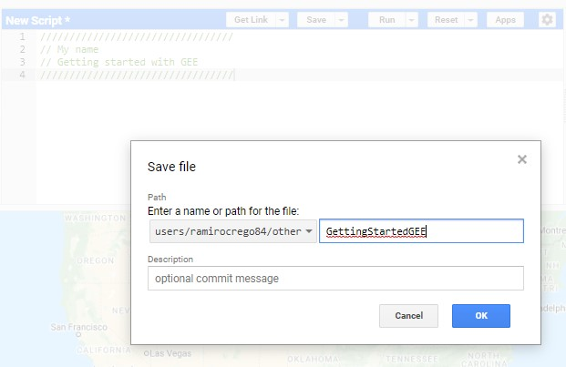
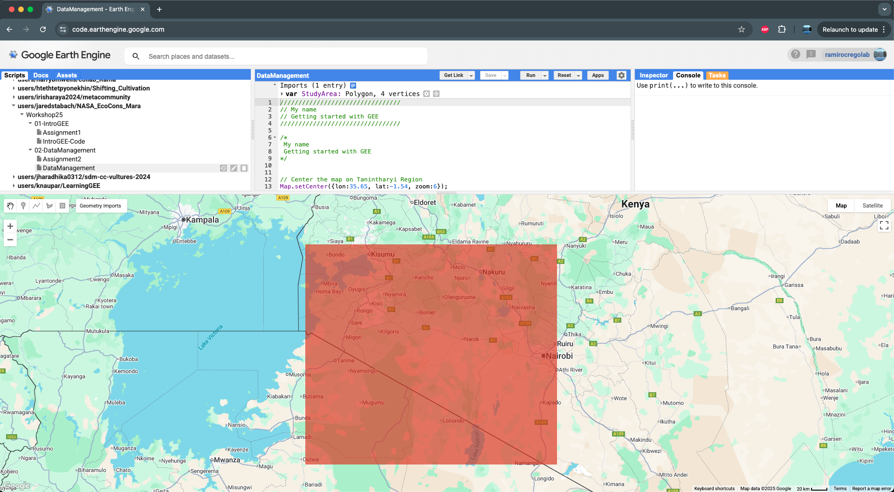
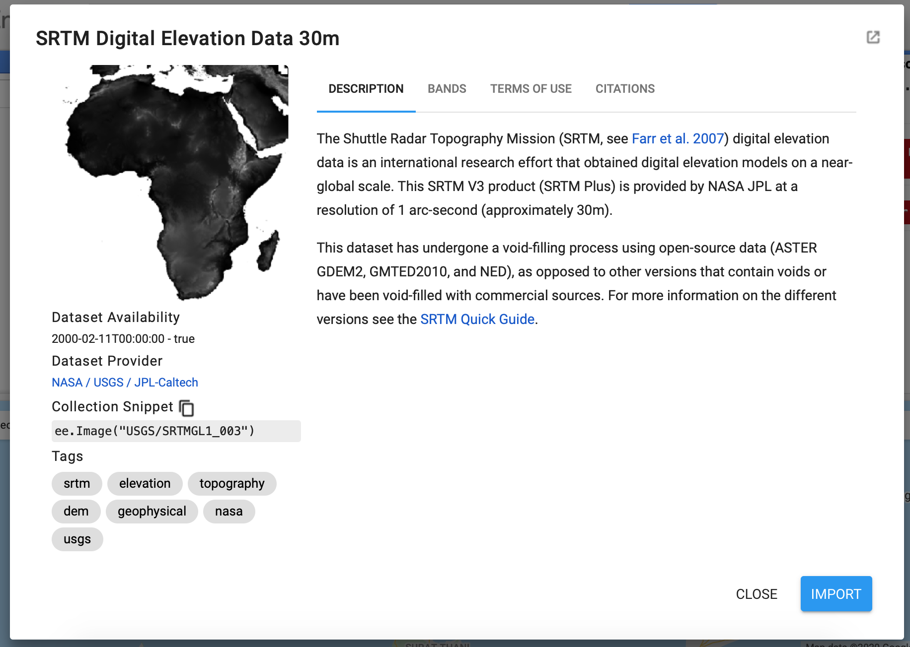
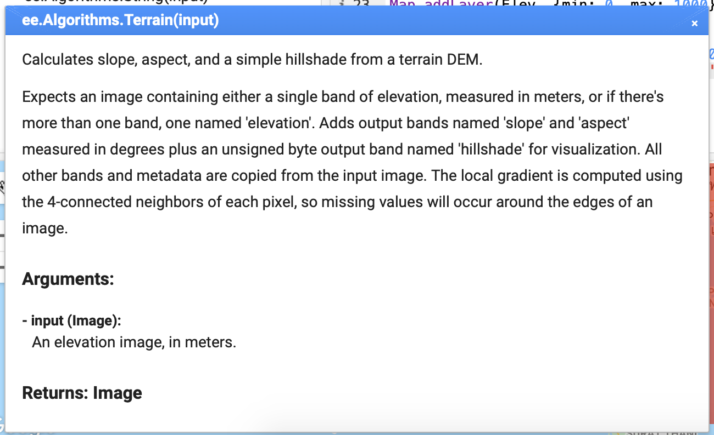
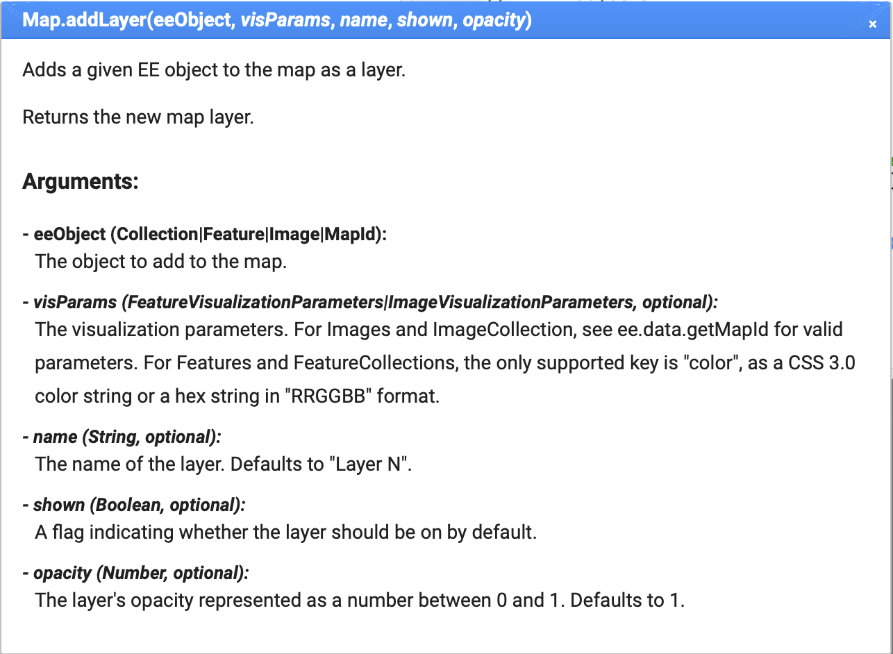
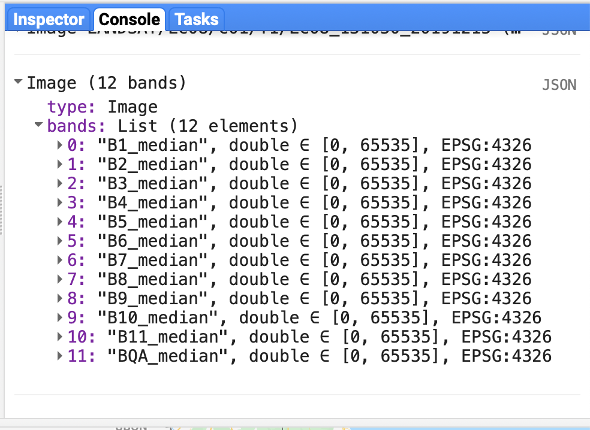
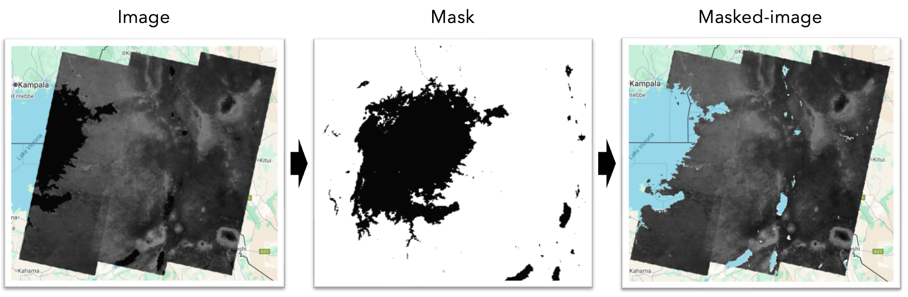
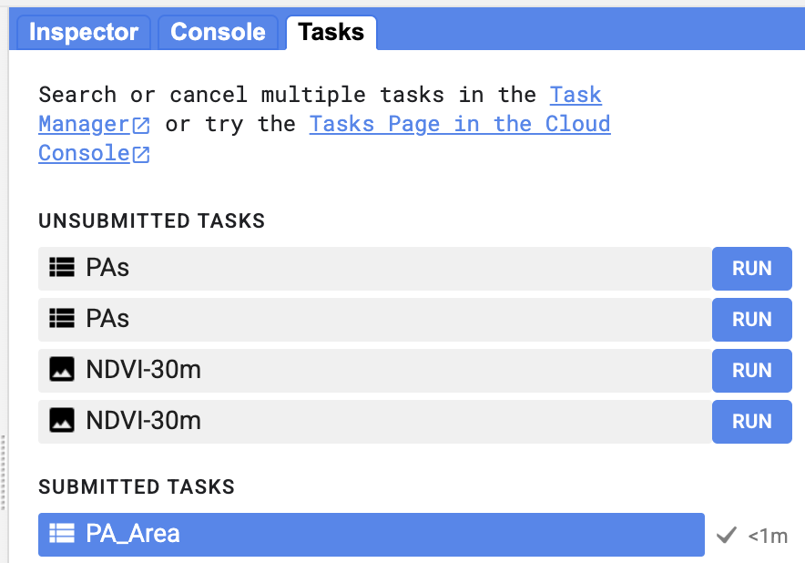
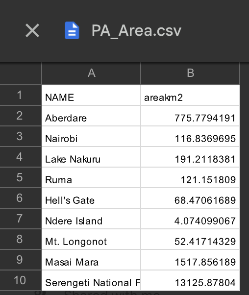

## Data management in Google Earth Engine

In this second section we will learn how to import, operate and display
images and features on Google Earth Engine (GEE). This is the basic
building block for any ecological spatial analysis and with time, this
set of operations and functions will become a simple habit.

In order to learn the basic procedures and functions to work in GEE, we
will develop a simple example. The idea is that after completing this
section, you will have a basic understanding on how to change the area
of interest, load and work with different data sets (both, images and
features) and perform some of the most common functions and operations.

The code on this section can be found [here](https://code.earthengine.google.com/b1c2e2681df2df0f54db5fcf1116bc70)

### Getting started

The first step in any project that involves coding is to start and save
a script where you can safely keep your work progress. First, using the
forward slash to comment out code, write a header to your script,
providing general information such as, your name and a title. Something
like this:

```{js, eval=F}
/////////////////////////////////
// My name
// Getting started with GEE
/////////////////////////////////
```

You can also comment chunks of code using a slightly different code:
`/* text */` This can be more handy for when you need to activate and
deactivate several lines of code at the same time.

```{js, eval=F}
/*
My name
Getting started with GEE
*/
```

You can choose the method that is easier for you.

After you completed the header, click on the **New button** on the
Scripts tab of the left panel. From the dropping menu, chose **File**.
This will open a window where you can provide a name and chose the
repository where to save your script. Give scripts proper names. You can
also provide a brief description of your project if desired. Once you
have saved the script for the first time, you just need to click
**Save** (Above the code editor panel) every time you want to save
updates to the script (Fig. 1).

<center>

<figure>

<figcaption aria-hidden="true">Figure 1. Saving a new
script.</figcaption>
</figure>

</center>


As you may recall from the introductory section, you can also create new
repositories and folders to keep your work organized and share them with
collaborators.

### Defining your study area

The study area for our example is in southeast Kenya. We will use this area to learn the basics of data manipulation in GEE, but you can pick any place on the globe.

To position the map display on the area of interest, we will use the
function `Map.setCenter()`, for which we need to provide coordinates and
a zoom level (higher numbers indicate larger scale or more zoomed in).
You may recall this from the previous section.

```{js, eval=F}
Map.setCenter({lon:35.65, lat:-1.54, zoom:6});
```

The next step is to define a geometry, in this case a rectangle, that
will represent the study area. Click on the rectangle icon from the
geometry tools and draw a rectangle that covers the area of interest
(see Fig. 2). We need to provide a name to the new geometry. Name it
StudyArea.

> Hint: You cannot use spaces for names, so we use capital letters or
> underscores to differenciate words. At the end, it does not matter
> what name you use, but it is good to use names for variables that you
> can recognize.

After you finish, the geometry will appear in your imports (top of the
script editor) as a polygon with four vertices. We will discuss more
about geometries later in this section.

<center>

<figure>

<figcaption aria-hidden="true">Figure 2. Rectangle geometry demarcating
the study area</figcaption>
</figure>

</center>


You can rename the geometry and save it as a new object using code:

```{js, eval=F}
var Bounds = StudyArea;
```
    
You have now defined the study area. Later, we will use this polygon to
clip images and restrict the extent of our analysis.

### Working with images

In GEE, raster data are represented as **Image objects** and are the
main type of data to work with. All images are composed on one or more
bands, where each band has a name, data type, scale, mask and
projection, as well as metadata stored as a set of properties. Let’s
start working with some simple images.

#### Loading images

The first step for our workflow is to import an image. Let’s start
working with a simple image with one band which contains information
about elevation, also known as Digital Elevation Models.

Remember from previous section that you can search for places, images,
image collections, and feature collections on the GEE Data Catalog.

To find the elevation data, on the search bar type: ‘SRTM Digital
Elevation Data 30m.’ Now, click on it to display the data description
where you can find information about the temporal availability, data
provider and collection ID (Fig. 3). This data set corresponds to a
digital elevation data from the Shuttle Radar Topography Mission (Farr
et al. 2007) and contains information of elevation at 30m spatial
resolution. You can click **import** to add it to your imports, or you
can use code. We encourage you to use code, so you get more familiarized
with it and also helps you to keep the work organized.

<center>

<figure>

<figcaption aria-hidden="true">Figure 3. SRTM Digital Elevation Data
description.</figcaption>
</figure>

</center>


The function `ee.Image()` allows you to import image catalogs. To import
the elevation data, we need to provide the directory to the data within
the parenthesis of the function. Remember to assign the image to a new
object using **var** as follows:

```{js, eval=F}
var Elev = ee.Image("USGS/SRTMGL1_003");
```

You have just imported the elevation data for the entire world.

When working in spatial ecology, frequently, slope, aspect and hillshade
are variables of interest as many species respond positively or
negatively to changes in the terrain surface. Thus, these data sets can
be good predictor variables in several models. We only have information
about elevation, but you can calculate slope, aspect and hillshade and
save them as new objects using other GEE built-in functions.

To calculate all these terrain variables, we will use the built-in
function `ee.Algorithms.Terrains()`.

Let’s apply the function to the elevation image and save it as a new
object.

```{js, eval=F}
var Terrain = ee.Algorithms.Terrain(Elev);
```
    
At this point, you should be familiarized with the code syntax to create
objects and use built-in functions in GEE.

Print both elevation images to display the information on the console.

```{js, eval=F}
print(Elev);
print(Terrain);
```

You will see that differently from the Elev image that contains one
band, the new image created (Terrain) contains four bands, one for each
variable: elevation, slope, aspect and hillshade. All of these three new
bands where calculated from the elevation data. If you want to know more
about the algorithms used to obtain these results, remember that for all
the Engine built-in functions you can use the API reference on the Docs
tab to see a description and all the parameters used by the function.
The `ee.Algorithms` category contains a list of currently supported
algorithms for specialized or domain specific processing.

Look for the `ee.Algorithms.Terrains()` function in the Docs tab (Fig.
4).

<center>

<figure>

<figcaption aria-hidden="true">Figure 4. View of the
ee.Algorithms.Terrains description in the Docs tab.</figcaption>
</figure>

</center>


This exercise shows you the versatility and power of conducting spatial
analysis on GEE. You can in matters of seconds, download elevation data
and calculate slope, aspect and hillshade for the entire world!

In many cases, we are only interested in one specific area and not the
entire planet. We can use the GEE built-in function `clip()` to crop the
image to our area of interest, the polygon we crated earlier.

Using the dot notation, we add the function `clip` to the image object
you want to crop, and specifying in between parenthesis the object
representing the area of interest we previously created.

```{js, eval=F}
var Terrain = Terrain.clip(Bounds);
```
    
You have now an image object cropped to the area of interest.

#### Displaying data on the map

Often, you will be interested in visualizing the images. To display the
elevation data on the map, you can use the function `Map.addLayer()`. To
the previous code, now add the function to display the data as follows:

```{js, eval=F}
Map.addLayer(Terrain);
```

Parameters for functions may have default values, and then, you only
need to specify the parameter if you want to change its default value.
For instance, the previous function displays a gray surface. You need to
change the default parameters for the appearance of the image to be able
to visualize elevation change.

In the case of the `Map.addLayers()` function, it contains five
arguments (Fig. 5). The first argument is the ee.Object to display, in
our case the **Elev object**. The second argument are the visualization
parameters, which you can pass to the function as a dictionary. Those
include the bands to display (when you have more than one band in the
image, such as the Terrain image created that has 4 bands), the minimum
and maximum values to display, and colors (Remember that you can also
change those parameters from the Layers button in the display). The
third argument is the name of the layer (a string). The fourth argument
is a Boolean number (i.e., 1 for TRUE or 0 for FALSE) and indicates
whether the layer should be displayed by default or be activated by the
user manually by clicking on the layers tab. The last argument in the
opacity, which goes from 0 (transparent) to 1.

<center>

<figure>

<figcaption aria-hidden="true">Figure 5. Description of the
Map.addLayers function.</figcaption>
</figure>

</center>


```{js, eval=F}
Map.addLayer(Elev, {min: 0, max: 3000}, 'DEM', 1);
Map.addLayer(Terrain, {bands:['elevation'] ,min: 0, max: 3000}, 'Elevation', 1); //Same as before but from the terrain object
Map.addLayer(Terrain, {bands:['slope'] ,min: 0, max: 10, palette:'white,red'}, 'Slope', 1); //Display slope and add a color palette
```
    

Note the difference between an image that was cropped and the one that
was not cropped. Play with the image visualization using the Layers
button in the display.

#### Image collections

We have so far worked with a single image. Now, we are going to access
an entire image collection. Image collections can contain hundreds of
images across long periods of time, such as images from satellites.
Similarly to the elevation image, you can search for image collections.
Let’s access the image collection of Landsat 8. Landsat images come with
different levels of pre-processing. Here we will work with T1, that is
the highest level of pre-processing.

Use the search bar to find the name of the Landsat 8 T1 image collection
and import it using the function `ee.ImageCollection()`.

```{js, eval=F}
var landsat8 = ee.ImageCollection("LANDSAT/LC08/C02/T1")
```

You just imported the entire image collection of Landsat 8 for the
entire Earth land surface. You could try to print the image collection
to see all the images contained in the list. However, because there are
too many images, printing it will either be very slow, time out, or
return an error.

#### Filtering and sorting

What we need to do to work with image collections is to filter them and
reduce the number of images in the list to the ones that we are
interested in. To do this, we will use filters.

Filters are a set of functions that allows you to select a set of images
based on certain parameters such as position, time windows, numbers,
properties, depending on the type of object you are trying to filter,
such as image collections, feature collections, lists or geometries.
Lets see how this works for image collections.

Let’s start by filtering our image collection by space and by time,
specifying the area and the time frame in which we are interested in
(Remember different satellite products contain images for different time
periods and that information is provided in the data description of each
product). We need to use `filterBounds()` to select images from our area
of interest (the object Bounds) and `filterDate()` to keep only images
from 2019, thus specifying a time window between 2019-01-01 and
2019-12-31. Note how we can add functions to the same line of code using
the dot notation.

```{js, eval=F}
var landsat8 = ee.ImageCollection("LANDSAT/LC08/C02/T1")
    .filterBounds(Bounds)
    .filterDate('2023-01-01', '2023-12-31')
```
    
The new object contains only images for which the path overlaps our area
of interest and that were obtained during 2019.

In addition, we are interested in finding images that are cloud-free.
Here we will use another function to solve this problem. All Landsat
images contain information about cloud cover in the metadata. We can use
this information to sort the image collection from lowest cloud cover to
highest cloud cover using the function `sort()`, which operates on the
image metadata. You could apply a new function to the object created
with the previous line of code. You can also simplify things by
concatenating functions in the same line of code, again using the dot
notation.

```{js, eval=F}
var landsat8 = ee.ImageCollection("LANDSAT/LC08/C02/T1")
    .filterBounds(Bounds)
    .filterDate('2023-01-01', '2023-12-31')
    .sort('CLOUD_COVER', true);

print(landsat8) //The image collection contains 106 images
```

The new image collection is now sorted by the cloud cover percentage,
from lowest to highest. We also see that the collection contains now 240
images.

You can save the first image (lowest cloud cover) as a new object and
display it. This time, you are displaying an image composed by a series
of bands and the final color display depends on the combination of bands
assigned to the tree main colors, red, green and blue. If you assign the
bands corresponding to the three colors, then you obtain a true color
display. You can also try a false color composition or displaying just
the thermal band.

```{js, eval=F}
var first_image = landsat8.first();

print(first_image)

// Display image
// True color
Map.addLayer(first_image, {bands: ['B4', 'B3', 'B2'], min: 7000, max: 13000}, 'Landsat8-RGB', 1);
// False color
Map.addLayer(first_image, {bands: ['B5', 'B4', 'B3'], min: 7000, max: 13000}, 'Landsat8-FalseColor', 1);
// Thermal
Map.addLayer(first_image, {bands: ['B10'], min: 27000, max: 37000, palette: ['blue', 'red', 'orange', 'yellow']}, 'Landsat8-Thermal', 1)
```

As always, you can access the complete GEE filtering functionality by
tipping `ee.Filter` into the search bar of the **Docs tab**.

#### Reducing

We have so far selected and printed the first image of the list. Now we
want to create a full mosaic of the study area with images that are free
of clouds. The reduce function allows to reduce image collections to a
single image. It is a way to aggregate data over time
(`imageCollection.reduce()`), space (`image.reduceRegion()`,
`image.reduceNeighborhood()`) or bands (`image.reduce()`).

The `ee.Reducer()` can be a used to operate a simple statistic for
aggregating data (e.g. minimum, maximum, mean, median, standard
deviation, etc.), or for more complicated analysis on the input data
(e.g. histogram, linear regression, list). In all these cases, the
reducer takes an input data set and calculates a single output. When a
single input reducer is applied to a multi-band image, such as Landsat
image, GEE automatically applies the reducer separately to each band,
producing an output image with the same number of bands as the input.

Continuing with our example, this time we will select all images with
less than 10% cloud cover and estimate the median value for each pixel
and each band in the Landsat 8 collection. To retain only images with
&lt;10% cloud cover we will use the function, `filterMetadata()` that
requires three arguments: The name of the metadata property, the name of
a comparison operator (it can be: “equals”, “less\_than”,
“greater\_than”, “not\_equals”, “not\_less\_than”, “not\_greater\_than”,
“starts\_with”, “ends\_with”, “not\_starts\_with”, “not\_ends\_with”,
“contains”, or “not\_contains”) and a number for the cloud cover
percentage to compare against. We will also increase the time period to
include images from the first day of 2015 to the last day of 2019 to
obtain a five years mosaic of our study area.

```{js, eval=F}
var l8_mosaic_1 = ee.ImageCollection("LANDSAT/LC08/C02/T1")
    .filterBounds(Bounds)
    .filterDate('2023-01-01', '2023-12-31')
    .filterMetadata('CLOUD_COVER', 'less_than', 10)
    .reduce(ee.Reducer.median());

print(l8_mosaic_1)
```

The reducer is going to change the name of the bands. When printing the
image, you can see that the band names have changed (Fig. 6).

<center>

<figure>

<figcaption aria-hidden="true">Figure 6. Band names for the mosaic after
applying a median reducer.</figcaption>
</figure>

</center>


Instead of using the reducer, you can use the built-in function
`median()` that will do the same operation on each pixel across the
stack of all matching bands but retain the original band names.

```{js, eval=F}
var l8_mosaic_2 = ee.ImageCollection("LANDSAT/LC08/C02/T1")
    .filterBounds(Bounds)
    .filterDate('2023-01-01', '2023-12-31')
    .filterMetadata('CLOUD_COVER', 'less_than', 10)
    .median();

Map.addLayer(l8_mosaic_2, {bands: ['B4', 'B3', 'B2'], min: 7000, max: 12800}, 'Landsat8-Mosaic', 1);
```
    
As we develop more complex analysis along the tutorial, we will learn more
specifics on the reducer functions. You can look into the `ee.Reduce`
methods that exist in the API.

#### Band math

Another powerful functionality is performing mathematical operations on
images or image bands. For example, you can use a combination of bands
to calculate vegetation indexes. One of the most widely used vegetation
indexes is the Normalized Difference Vegetation Index (NDVI). This index
provides an estimation of vegetation productivity, thus, is widely used
in spatial ecology studies. It is calculated using the near infrared and
red bands as follows:

*N**D**V**I* = (*N**I**F*−*R**E**D*)/(*N**I**R*+*R**E**D*)

To demonstrate the versatility of GEE to perform mathematical operations
on images, we will calculate NDVI using different methods.

Some simple image math can be performed by using `add()`, `subtract()`,
`divide()`, `multiply()`, `pow()`, etc. Those operators can be applied
on numbers, images or arrays. We can use these operators to calculate
NDVI.

First, we need to `select` the desired bands from the image and then
apply the mathematical operation. For our example, we need the red band
(band 4) and the near infrared band (band 5):

```{js, eval=F}
// Method 1 - Applying band operations
var ndvi_1 = l8_mosaic_2.select('B5').subtract(l8_mosaic_2.select('B4'))
      .divide(l8_mosaic_2.select('B5').add(l8_mosaic_2.select('B4')));
```
    
However, it is generally the case that you need to perform more
complicated mathematical operations. For those cases, you can use the
`expression()` function, which allows to represent math operation in
text forms.

```{js, eval=F}
// Method 2 - Applying band opperations using a expression
var ndvi_2 = l8_mosaic_2.expression('(B5 - B4) / (B5 + B4)', {
        B5: l8_mosaic_2.select('B5'),
        B4: l8_mosaic_2.select('B4')
    });
```
   
Note that `expression()` returns an integer if two integers are divided,
so that the expression 10 / 20 = 0. To obtain decimal numbers as
results, you need to have decimal numbers in the operations. For
instance, in the previous case, you have to multiply one of the operands
by 1.0: 10 \* 1.0 / 20 = 0.5.

For many basic operations, such as calculating vegetation indexes, often
exists a built-in function in Earth Engine that makes things much
easier. Here, we will use the `normilizedDifference()` function. We need
to provide the name of the two bands to use.

```{js, eval=F}
// Method 3 - Using a built-in function
var ndvi_3 = l8_mosaic_2.normalizedDifference(['B5', 'B4'])
```
    
Finally, it may be the case that you want to write your own function.
The advantage of writing a function is that you can then apply the
function to any image you want to work with. Here, we are going to write
a function that calculated NDVI (function `normilizedDifference()`),
renames the resulting band as NDVI (function `rename()`) and adds it to
the image as a new band (function `addBands()`).

```{js, eval=F}
// Method 4 - Building your own function to compute NDVI and add it as a new band to the image
var addNDVI = function(image) {
var NDVI = image.normalizedDifference(['B5', 'B4']).rename('NDVI')
    return image.addBands(NDVI) //with addBands, the new NDVI is added as a new band to the existing bands.
    };

// Apply the function to the mosaic
var l8_mosaic_3 = addNDVI(l8_mosaic_2);
```
    
You can also use the function `map()` to apply the addNDVI function you
have created to an entire image collection. As a result, all the images
on the collection will have an additional band called NDVI.

```{js, eval=F}
var l8_NDVI = ee.ImageCollection("LANDSAT/LC08/C02/T1")
    .filterBounds(Bounds)
    .filterDate('2023-01-01', '2023-12-31')
    .filterMetadata('CLOUD_COVER', 'less_than', 10)
    .map(addNDVI);
```

#### Masking

Another common operation when working with images is masking. Masking
refers to setting certain pixels from an image to no data values (i.e.,
making them transparent) in order to exclude them from analyses. Masking
is usually done to remove pixels with poor data, representing clouds or
any other area that wants to be excluded.

Every pixel in a band of an `ee.Image`, in addition to its value, has a
mask which ranges from 0 (i.e., no data) to 1. In Earth Engine, all
masked pixels (0) are treated as no data. When applying a mask, pixels
with a value of 0 are then excluded from operations. For instance, when
applying `image1.mask(image2)`, the values of image2 are taken and used
as a mask of image 1, meaning that pixels in image2 that have the value
0 will be made transparent in image1.

Continuing with our example, we may be interested in removing all the 
water from the NDVI image. We need to create a mask that will
retain only the land pixels (Fig. 7).

<center>

<figure>

<figcaption aria-hidden="true">Figure 7. Masking process.</figcaption>
</figure>

</center>


To do this, we will use a surface water product. We will first select the band 
`max_extent` which is a binary image containing 1 anywhere water has ever been detected.
We can use the function `eq()` (equal) to create a binary image with a value of 1 for all pixels with permanent water (pixel values equal to 1), and a value of 0 to pixels with no water. Then we use the function `updateMask()` to retain only NDVI values from the land.

```{js, eval=F}
// Create a land mask using surface water dataset.
var watermask =  ee.Image('JRC/GSW1_4/GlobalSurfaceWater').select('max_extent').eq(0);

// Update NDVI mask with the land mask.
var maskedndvi_1 = ndvi_1.updateMask(watermask);

// Display the masked result.
Map.addLayer(maskedndvi_1, {min:0, max:1}, 'NDVI masked');
```

Masks can be particularly useful in cases where you cannot find images
that are cloud free and you need to mask those pixels for analysis. 

### Working with features

In addition to the raster datasets, we can use vector data in GEE.
Vector data is handled with the Geometry type. Geometries in Earth
Engine can be **Point** (a list of coordinates in some projection),
**LineString** (a list of points), **LinearRing** (a closed LineString),
and **Polygon** (a list of LinearRings where the first is a shell and
subsequent rings are holes). **MultiPoint**, **MultiLineString**, and
**MultiPolygon** are also supported.

#### Geometries and features

You can create Geometries using the Code Editor geometry tools, as you
did at the beginning of the section to define your study area. However,
you can also use code to create geometries, by providing a list of
coordinates. The following code will create the polygon representing the
study area defined earlier. All we need is a list of pair of
coordinates, indicating the vertices of the polygon. Check that the
first and last coordinates are the same.

```{js, eval=F}
var polygon = ee.Geometry.Polygon([
  [[34.20, -2.46], [41.63, -2.46], [41.63, 4.07], [34.20, 4.07], [34.20, -2.46]]
]);
```

Geometries can then be converted into features. A **Feature** is an
object with a geometry property storing a **Geometry** object (or null)
and a **property** storing a dictionary of other properties. In order to
create a feature, you need to provide a geometry, but also a dictionary
with other properties of interest.

```{js, eval=F}
var polyFeature = ee.Feature(polygon, {Area: 'Kanya'});

```


**Geometry** and **Feature** objects can be printed or added to the map
similarly to images using `Map.addLayer()`. The default visualization
parameters will display vectors with solid black lines and semi-opaque
black fill. You can change the colors similarly to images.

```{js, eval=F}
print(polyFeature);
Map.addLayer(polyFeature, {}, 'Study area');
Map.addLayer(polyFeature, {color: 'red'}, 'Study area - red');
```

#### Feature collections

Similar to image collections, you can create a feature collection, that
is as the name implies, a collection of features. To do this, we need to
apply `ee.FeatureCollection()` on a list of features. For instance, we
can create a list of feature points, each of which represents a town
with its coordinate (the geometry) and a dictionary with the name of the
town. We can then combine all the town into a feature collection.

```{js, eval=F}
// Make a list of Features
var feature_list = [
  ee.Feature(ee.Geometry.Point(36.07,-0.29), {name: 'Nakuru'}),
  ee.Feature(ee.Geometry.Point(36.82,-1.29), {name: 'Nairobi'})
];

// Create a FeatureCollection from the list, print it and display it on the map
var Towns = ee.FeatureCollection(feature_list);
print(Towns);
Map.addLayer(Towns, {color: 'blue'}, 'Towns');
```
    
Google Earth Engine offers several **Feature collections** through the
Data Catalog that can be imported. They are mostly data sets for the USA
but, in addition to the protected areas we used, there are also country
boundaries and ecoregions, among others. This is a much smaller catalog
than the one for image collections, but the amount of data available
grows every day.

#### Filtering feature collections

Feature collection can be large, and similar to image collections, we
may need to filter them. We will also use filters to do this. Here, we
will load the World Database on Protected Areas and filter it to our
study area, similarly to what we did before to filter the Landsat image
collection.

```{js, eval=F}
// Load a FeatureCollection of World Database on Protected Areas.
var PA = ee.FeatureCollection('WCMC/WDPA/current/polygons');

// Filter the ecoregions to the study area
var PA_filtered = PA.filterBounds(Bounds);
```

You can now check how many protected areas are within the study area by
using `size()` which returns the number of entries in a dictionary.

```{js, eval=F}
print('Count after filter:', PA_filtered.size());
```
    
Now, let’s filter the protected areas on our study area that are IUCN category I and II. 
We can use the `ee.Filter.inList()` function to retain only those protected areas designated as IUCN Category I and II and check how many there are. For the `ee.Filter.inList()` function, we need to pass two arguments, the name of the property we want to filter, and a list of names.

```{js, eval=F}
// Filter to get only IUCN Cat I and II
var NatParksIUCNIandII = PA_filtered.filter(
  ee.Filter.inList('IUCN_CAT', ['I','II'])
  );
  
// Check the number of parks after filtering
print('Number of IUCN Cat I and II Parks:', NatParksIUCNIandII.size());
```

Finally, lets filter the dataset to retain only the Masai Mara reserve boundary. Here, we will use the `ee.Filter.eq()` (eq for equal) function. As before, you need to provide the property name of the feature to filter on and the value to compare against.

```{js, eval=F}
var Mara = PA_filtered.filter(ee.Filter.eq('NAME', 'Masai Mara'));
```

#### Mapping functions over feature collections

Similar to what we learned about mapping functions over image
collections, we can do it on feature collections. Let’s say you are
interested in calculating the area of each filtered National Park. We will
do this as an exercise even though the Protected Area database already
has a property with the area of each feature.

First, we define a function to apply to each feature. The function
calculates the area using the `area()` function. We then divide this by
1000000 to obtain area in square kilometers. The resulting number is set
to each feature as a new property that we called areakm2.

Second, we map the `addArea` function we created across the
**NatParksIUCNIandII** feature collection.

```{js, eval=F}
// Function to compute patch area and perimeter and add it as a property
var addArea = function(feature) {
  return feature.set({areakm2: feature.area().divide(1000 * 1000)});
};

// Map the area using the function over the FeatureCollection
var Area = NatParksIUCNIandII.map(addArea);
```

#### Reducing feature collections

We can also apply reducers to feature collections. The idea is the same
than for image collections, aggregate data over the collection. Here, we
use the `reduceColumns()` function on the Area feature collection
previously created. We need to specify the reducer we want to apply, in
this case the `ee.Reducer.mean()`, and the property or list of
properties we want to reduce, in this case `areakm2`. When printing this
object we have a new property with the mean area of all Protected Areas
in the collection.

```{js, eval=F}
// Calculate the mean area across parks
print('Park area (km2):', Area.reduceColumns(ee.Reducer.mean(), ['areakm2']));
```


#### Displaying fature and feature collections on the map

Finally, you can display the protected areas and Marine National Parks
on the map. We use the same function than more images,
`Map.addLayers()`.

```{js, eval=F}
// Display them with a custom color
Map.addLayer(PA_filtered, {color: 'green'}, 'Protected Areas');
Map.addLayer(NatParksIUCNIandII, {color: 'blue'}, 'IUCN I & II'); 
Map.addLayer(Mara, {color: 'red'}, 'Masai Mara');
```
   
   
### Exporting resuts

Lastly, at the end of an analysis you may want to export your results
and data products. There are many reasons you may want to do this. The
most obvious is to create figures and maps using another software, such
as [QGIS](https://qgis.org/en/site/) or to use raster and vector
products in other analysis in software such as
[R](https://www.r-project.org/).

There are different type of products that can be exported from GEE.
These include images, map tiles, features, tables and videos. The data
can be exported to your linked Google Drive account, as a new Earth
Engine asset that will appear on your asset manager, or to Google Cloud
Storage (Note this is a fee-based service). We will not cover Cloud
Storage in this tutorial, but you can learn about Cloud Storage
[here](https://developers.google.com/earth-engine/cloud/earthengine_cloud_project_setup?hl=en)
and how to set projects
[here](https://developers.google.com/earth-engine/cloud/projects?hl=en).

Here, we are going to demonstrate how to export an image and a feature
collection. We will see more about these functions along the different
sections.

#### Exporting an image

Imagine that you want to create a map of your study area displaying the
NDVI values across the region. You can then export the final NDVI image
we created previously **maskedndvi\_1**. We will export the image to
Google Drive, where it can be downloaded to be used in other software.
For this, we will use the function `Export.image.toDrive()`.

All export functions have a series of arguments that we need to
complete. First, we need to specify the `image` we want to export, in
our case the **maskedndvi\_1**. Second, we need to provide a
`description` that will be the file name when saved in Google Drive.
Then we need a `scale` parameter, the spacial resolution or pixel size
in meters, and a `region`, a ee.Geometry object that defines your area
of interest. In our example, we have been using **Bounds**. Another
important argument is the `maxPixels`. The default is 1e8 pixels, but
you can increase this number as needed. Note that when the image is too
big, it will be exported in tiles as 2 or more images that then you can
combine. The image default output is **GeoTIFF**, but the **TFRecord**
format is also supported.

There are several other optional arguments for this functions. Here we
show two extra arguments. The `folder` within your Google Drive to keep
it organized (By default the image will be saved in the Drive root
directory) and the `crs`. The coordinate reference system is optional,
but we include it here because it is important to keep track of the crs
used when exporting data to use in other GIS software.

Here is the code:

```{js, eval=F}
// Export raster image to Google Drive
Export.image.toDrive({
  image: maskedndvi_1,  // Export the masked NDVI as an example
  region: Bounds,
  description: 'NDVI-30m',
  folder: 'GIS',
  scale: 30,
  fileFormat: 'GeoTIFF',
  maxPixels: 1e10
});
```

In other cases, you may be interested in saving an image as an asset, so
you can use it later in other analyses. To do this, we will use the
function `Export.image.toAsset()`. The difference with exporting to
Google Drive is that we now need to provide an `assetId` as an extra
parameter and that we do not need to specify a file format anymore.

```{js, eval=F}
// Export raster image to asset
Export.image.toAsset({
  image: maskedndvi_1,  // Export the masked NDVI as an example
  region: Bounds,
  description: 'NDVI-30m',
  assetId: 'NDVI30mExport',
  scale: 30,
  maxPixels: 1e10,
  crs: 'EPSG:4326'
});
```


There are other optional arguments that can be modified. Look into the
Export of the Docs tab to explore other arguments.

#### Exporting a feature collection and tables

Similar to images, we can export feature collections or tabular data,
such as a future collection with no geometry, as CSV, ESRI Shapefile
(SHP), GeoJSON, KML, KMZ or TFRecord formats. Again, we can export to
Google Drive using the function `Export.table.toDrive()` or as an asset
`export.table.toAsset()`. The arguments that we need to specify include
the `collection` to export and a `description` with the name for the
resulting file. When exporting to Google Drive we also need to provide
the `fileFormat` and we will also specify a `folder` in Google Drive.
When exporting as an asset, we need to provide the `assetId`.

Here we will export the marine national parks (the object
**MarineNatParks**) as a shapefile and also save it as an asset.

```{js, eval=F}
// Export feature to Google Drive
Export.table.toDrive({
  collection: NatParksIUCNIandII,  // Export the marine parks as an example
  description: 'PAs',
  fileFormat: 'SHP',
  folder: 'GIS'
});

// Export feature to asset
Export.table.toAsset({
  collection: NatParksIUCNIandII,  // Export the marine parks as an example
  description: 'PAs',
  assetId: 'PAsExport'
});
```


Finally, we will export the PA area as table data in a
CSV format. This object will not have a geometry associated, only the
area we calculated for each feature. For this we use the
`Export.table.toDrive()` we used before with the difference that now the
`fileFormat` is CSV. We also use the `selectors` argument to specify the
property we want to export, NAME and areakm2 of each park. You can add
other properties if wanted.

```{js, eval=F}
// Export table data
Export.table.toDrive({
  collection: Area,
  description: 'PA_Area',
  fileFormat: 'CSV',
  folder: 'GIS',
  selectors: ['NAME','areakm2'] //A list of properties to include in the export; either a single string with comma-separated names or a list of strings.
});
```
 
Note that to complete the export process you need to submit the task by
clicking the `run` button on the Tasks tab on the right panel (Fig. 8).
When the process is completed, the taks changes to a blue color as shown
in Fig. 8.

<center>

<figure>

<figcaption aria-hidden="true">Figure 8. Exporting images and
features.</figcaption>
</figure>

</center>


You will see the csv file in your Google Drive (Fig. 9).

<center>

<figure>

<figcaption aria-hidden="true">Figure 9. CSV file exported with name and
area of Marine National Parks.</figcaption>
</figure>

</center>


### Conclusion

So far, we have seen some common functions to apply on images and
features. There are an enormous amount of possible operations that can
be applied to filter collections, calculate new bands, etc. As we
progress with different types of analyses, you will get more
familiarized with the different possible operations.

---

### Assignment 2

In this second section, we have covered the basics of image, image collection, feature and feature collection operations in Google Earth Engine. The set of tools we have learned are the building blocks for more complex analyses. Thus, it is important to make sure you are familiar with these operations.

Here are some activities that will help you practice the skills we covered. This assignment consists of four activities with increasing levels of difficulty.

1. [Easy] Filter and display the Masai Mara boundary. You will use this feature for the subsequent activities.

2. [Easy] Select any image dataset from the GEE catalog that we did not use in the training. Export this image as a GeoTIFF to your Google Drive setting the extent for the Masai Mara.

3. [Moderate] Create a time series chart to compare mean NDVI and EVI from the MODIS satellite (Collection Name: MOD13Q1.006 Terra Vegetation Indices 16-Day Global 250m of MODIS) for the Masai Mara. Tip: [Here you can find examples of charts](https://developers.google.com/earth-engine/guides/charts_image_collection#uichartimageseries). You will need to use the `ui.Chart.image.series` function.

4. [Advanced] Load a road dataset for Africa using this feature collection 
`ee.FeatureCollection("projects/sat-io/open-datasets/GRIP4/Africa");`
Create a distance to roads image for the entire Masai Mara.

5. [Advanced] Write a function to calculate a Modified Soil Adjusted Vegetation Index band (MSAVI).
     [https://www.usgs.gov/landsat-missions/landsat-modified-soil-adjusted-vegetation-index](https://www.usgs.gov/landsat-missions/landsat-modified-soil-adjusted-vegetation-index). Map this function across a Landsat 8 collection to add an MSAVI band to each image
Create a median pixel composite and add this layer to your map window.

Solutions code by clicking [here](https://code.earthengine.google.com/c550161bdb8fa961412d79d715462b32)


---
