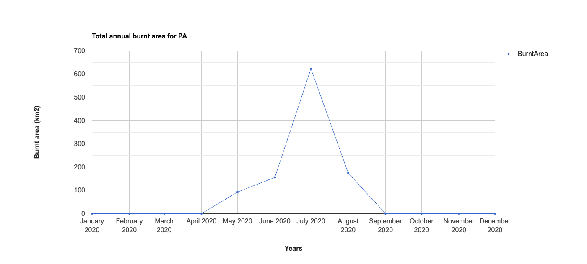
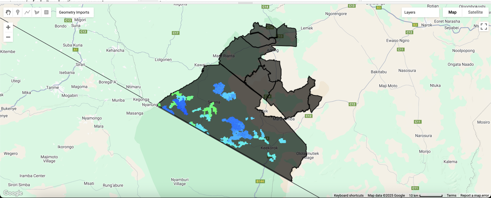

## Exporting data and making a map in R

This third section is intended for you to practice what you have learned and then connect it to R, so we start to bring back things we have learned in the past.


### Export an image from GEE

We will first start by creating an image in GEE and then exporting it to Google Drive. 

Here, I present an example to map fires across the Mara region using the `ESA/CCI/FireCCI/5_1` product. This MODIS Fire_cci Burned Area product is a monthly global ~250m spatial resolution dataset containing information on burned area. The dataset includes, among other information, for each pixel the estimated day of the first detection of the fire. For a complete description of this dataset, see the information available on GEE.

#### Define your area of interest

We can recall from the previous lesson how to use the World PA polygons to use the Mara and Great Mara Conservancies boundaries as our area of interest (AOI).

Note, that I have created a geometry that I then use to filter the entire PA feature collection.

```{js, eval=F}
var PA = ee.FeatureCollection('WCMC/WDPA/current/polygons');
// Filter to the Masai Mara
var AOI = PA.filterBounds(geometry);
Map.centerObject(AOI, 8)
Map.addLayer(AOI, {}, 'Masai Mara')
```

#### Load fire dataset

We now need to load the fire image collection and filter it to the time frame we want. For this example, we will work with the year 2020. We then need to select the `BunrDate` band. This represents the estimated day of the year of the first detection of the burn.

```{js, eval=F}
// Visualize FireCCI51 for one year
var annualFire = ee.ImageCollection('ESA/CCI/FireCCI/5_1')
                  .filterDate('2020-01-01', '2020-12-31')
                  .select('BurnDate');
print(annualFire)
```

#### Calculate area burnt per month

Next, we will create a function to calculate the area of each burn pixel. That is, we need to keep only burn pixels and then multiply my 0.25 to get the area in square kilometers. Then, we can map the function across the image collection.

```{js, eval=F}
var burnDateToArea = function(img){
  var firearea = img.gte(0).multiply(0.25) // 0.5 * 0.5 km
                    .rename('BurntArea');
  return img.addBands(firearea);
};

var annualBurntArea = annualFire
            .map(burnDateToArea);
```

Next, we are going to plot the annual burnt area across the year. For this, we use the `ui.Chart.image.series()` function in GEE. We use a reducer to sum all the burnt area across the region for each month. Note that the function to calculate pixel area is not handy to get an overall estimate of burnt area.

```{js, eval=F}
// Plot annual burnt area time series aggregated over the region of interest (AOI)
print(ui.Chart.image.series(annualBurntArea.select('BurntArea'), AOI, ee.Reducer.sum(), 250) // 250m resolution
    .setOptions({
      title: 'Total annual burnt area for PA',
      hAxis:
            {title: 'Years', titleTextStyle: {italic: false, bold: true}},
      vAxis: {
            title: 'Burnt area (km2)',
            titleTextStyle: {italic: false, bold: true}
          },
      lineWidth: 1,
      pointSize: 3,
}));
```

You should get something like this chart:

<center>

<figure>

</figure>

</center>

#### Plot image

We can also visualize the image, with each color representing the last time at which the area was burnt. For this, we need to get the maximum value across the year image collection.

```{js, eval=F}
// Use a circular palette to assign colors to date of first detection
var baVis = {
  min: 1,
  max: 366,
  palette: [
    'ff0000', 'fd4100', 'fb8200', 'f9c400', 'f2ff00', 'b6ff05',
    '7aff0a', '3eff0f', '02ff15', '00ff55', '00ff99', '00ffdd',
    '00ddff', '0098ff', '0052ff', '0210ff', '3a0dfb', '7209f6',
    'a905f1', 'e102ed', 'ff00cc', 'ff0089', 'ff0047', 'ff0004'
  ]
};
var maxBA = annualBurntArea.select("BurnDate").max().clip(AOI);
print(maxBA)

Map.addLayer(maxBA, baVis, 'Burned Area');
```

<center>

<figure>

</figure>

</center>

#### Export data

Finally, we export the maxBA image and the PA polygons to Google Drive. We will use this products to make a map in R.

Something important is that we need to provide some number to the background pixels, which we want later to be NAs, so pixels with no data. We will do this by using the function `unmask()` and providing all background pixels a value of -9999. We will then transform those numbers to NAs in R.

```{js, eval=F}
// Export raster image to Google Drive
Export.image.toDrive({
  image: maxBA.unmask(-9999), 
  region: AOI,
  description: 'BurntAreas',
  folder: 'GIS',
  scale: 250,
  fileFormat: 'GeoTIFF',
  maxPixels: 1e10
});

// Export feature to Google Drive
Export.table.toDrive({
  collection: AOI,  
  description: 'PAs',
  fileFormat: 'SHP',
  folder: 'GIS'
});
```

All the code to conduct this exercise can be retrieved from this [link](https://code.earthengine.google.com/be7804ad2f811e11c4f6658bf20bb634).

### Creating a map in R

We will now move into R to learn how to make a cool map. For this, we will be learning the basics of making maps in R.

Before we start, and if you are not using an R project, do not forget to set your working directory

```{r, eval=F}
setwd("...")
# don't forget to set the directory to your own data folder!!
```

#### Making pretty maps with R

R  offers the opportunity to create beautiful high quality maps for publication. This saves you from having to export all files to make the final maps in other software, such as ArcGIS or QGIS.

Making maps is like art. Good maps can help enormously with presenting your results to an audience. It takes skills and practice. 
When combining R powerful data processing with visualization packages, we can move beyond static maps. Here, we will learn the basics for making two type of maps:

1. Static maps
2. Interactive maps

We will use the 'tmap' package, which is a great new addition to R tools. Tmap is a powerful and flexible package with a concise syntax that is similar to ggplot2 users. It also has the unique capability to generate static and interactive maps using the same code via `tmap_mode()`.

```{r}
library(tmap)
library(spData)
```

Before we start using tmap, remember that you always have the help. Some functions in tmap have lots of arguments that can be edited. We will cover some basics here, hoping that you will explore more options on your own.

#### Static maps - the basics

We will use generic data to demonstrate the basics, and then use some of the data from this chapter to create a publishable map.

Static maps are the most common and traditional outputs from geospatial analysis.

Tmap syntax involves a separation between the input data and the aesthetics for data visualization. Each input dataset can be displayed in many different ways, largely depending on the nature of the data (raster, points, polygons, etc.) 

The dataset we are using here is the world object from the 'spData' package. It contains some variables from the World Bank.

In tmap the basic building block is `tm_shape()`, which creates a tmap-element that defines input data as vector or raster objects. We can then add one or more layer elements such as `tm_fill()`, `tm_borders()`, `tm_dots()`, `tm_raster()`, depending what you want to display.

Here a simple example:

```{r}
data(world)

# Add fill layer to shape
tm_shape(world) +
  tm_fill() 
# Add border layer to shape
tm_shape(world) +
  tm_borders() 
# Add fill and border layers to shape
tm_shape(world) +
  tm_fill() +
  tm_borders() 
```

Objects in tmap can be store with names, similar to ggplot, and then called or used as starting point to add more objects.

```{r}
map1 <- tm_shape(world) +
  tm_fill() +
  tm_borders() 
map1
```

If we want to add more objects (e.g., another shapefile), we use `+ tm_shape(new_obj)`. When a new shape is added in this way, all subsequent aesthetic functions refer to it, until another new shape is added. This syntax allows the creation of maps with multiple shapes and layers.

```{r}
tm_shape(world) + 
    tm_borders() + 
tm_shape(urban_agglomerations) + 
    tm_dots(size = "population_millions")
```

In addition, you can change the aesthetics of the maps using either variable fields (data in your shapefile) or constant values. The most commonly used aesthetics for fill and border layers include color, transparency, line width and line type. In the new version of tmap, we set color for the area of polygons using the `fill` argument and the color of borders using the `col` argument. To add transparency, we use `fill_alpha` and `col_alpha`.

Here some examples on using constant numbers and colors. Note the use of `tmap_arrange` to plot multiple maps.

```{r}
ma1 = tm_shape(world) + tm_fill(fill = "red")
ma2 = tm_shape(world) + tm_fill(fill = "red", fill_alpha = 0.3)
ma3 = tm_shape(world) + tm_borders(col = "blue")
ma4 = tm_shape(world) + tm_borders(lwd = 3)
ma5 = tm_shape(world) + tm_borders(lty = 2)
ma6 = tm_shape(world) + tm_fill(fill = "red", fill_alpha = 0.3) +
  tm_borders(col = "blue", col_alpha = 0.6, lwd = 3, lty = 2)
tmap_arrange(ma1, ma2, ma3, ma4, ma5, ma6)
```

But we can also color the maps based on some variable of interest. You can use the default breaks for continuous variables or define your own. We use the `fill.scale` argument to set the color palette and the number of bins into which numeric variables are categorized. Here, we will use the `brewer.bu_gn` palette that gives different tones of blue. 

You can use palettes from the R package cols4all. Run `cols4all::c4a_gui()` to explore them.

Lets plot population size by country:

```{r, message = F}
tm_shape(world) + tm_polygons(fill = "pop") #default breaks
breaks = c(0, 2, 5, 10, 100, 500, 2000) * 1000000 # customized breaks
tm_shape(world) + tm_polygons(fill = "pop", fill.scale = tm_scale(values = "brewer.bu_gn", breaks = breaks))
```

Finally, we need to make a good legend. This is controled by the argument `fill.legend` for the fill in which you can control the name, position, orientation, etc. Note that if you want to specify legends for other commands, you will need to use the proper argument (e.g., `lwd.legend`). Check the help to learn more.

```{r, message = F}
tm_shape(world) + 
  tm_polygons(fill = "pop", fill.scale = tm_scale(values = "brewer.bu_gn", breaks = breaks), fill.legend = tm_legend(
    	title = "Population", orientation = "landscape",
    	position = tm_pos_out("center", "bottom"), frame = FALSE
    	))
```

So far we have been editing the objects, but a good map needs other elements in the layout. These include title, scale bar, north arrow, any text, etc. 

Additional elements such as north arrows and scale bars have their own functions: `tm_compass()` and `tm_scalebar()`. Here is an example on how to add the north arrow.

```{r, message = F}
tm_shape(world) + 
  tm_polygons(fill = "pop", fill.scale = tm_scale(values = "brewer.bu_gn", breaks = breaks), fill.legend = tm_legend(
    	title = "Population", orientation = "landscape",
    	position = tm_pos_out("center", "bottom"), frame = FALSE
    	)) +
  tm_compass(position = c("left", "bottom"))
```

#### Interactive maps

It was cool to make animated maps, but we can now take maps to a new level with interactive maps. The release of the 'leaflet' package in 2015 revolutionized interactive web map creation from within R and a number of packages have built on it since then. 

Here we will learn how to create interactive maps using tmaps. Tmaps has a unique function that allows to display your maps as static or interactive. The only caution is that certain features such as scale bars and north arrows are not displayed or used in interactive mode. It also has some limitations on the legends that can be created. But depending on the purpose, it is worth how much you gain.

All you need to do is switching to view mode, using the command `tmap_mode("view")`.

Lets display one of our previous maps on the interactive mode:

```{r}
tmap_mode("view")
tm_shape(world) + tm_polygons(fill = "pop", fill.scale = tm_scale(values = "brewer.bu_gn", breaks = breaks), fill.legend = tm_legend(
    	title = "Population"))
```

You can navigate the map and click on each country to query the population size. You can also change the base map displayed. This type of map is displayed in html, and be saved as an html file to share or even to insert in your own website.

### Creating your own high quality map.

First, lets load necessary packages:

```{r, message=FALSE}
library(sf)
library(terra)
library(tidyverse)
library(tmap)
```

Now, we need to load the image and Shapefile we exported from GEE. Make sure to move all the files into the directory you are working in. You could set up a `googldrive` package to connect directly R to your repository, but we will keep it simple here. Download the files from your Google drive and move those files into the working directory you are using with R.

Note we use `st_read()` from the `sf` package to read a shapefile, and we use `rast()` from the `terra` package to read a raster file. 

```{r}
PAs <- st_read("./Data/PAs.shp")
BurntA <- rast("./Data/BurntAreas.tif")
```

If you recall, we set all background pixels in the image in GEE to -9999. We need now to transform those values to NAs. We can do a simple plot to ensure the image is what we expect.

```{r}
BurntA[BurntA == -9999] <- NA
plot(BurntA)
```

Now, we have all we need to make a map. We will start with a static map.

```{r}
tmap_mode("plot")

tm_shape(BurntA) + tm_raster(col.scale = tm_scale_continuous(values = heat.colors(9)), col.legend = tm_legend( "Burn date (Julian day)")) +
  tm_shape(PAs) + tm_borders(lty = 1) +
  tm_compass(position = c("right", "top")) +
  tm_scalebar(position = c("left", "bottom"), width = 30) + tm_layout(frame = FALSE, legend.outside = T, legend.frame = F, legend.title.size = 1, legend.text.size = 0.7) + tm_add_legend(type = c("lines"), fill = c('black'), labels = c("Conservancies"))
```

And now interactive. 

```{r}
tmap_mode("view")

tm_shape(BurntA) + tm_raster(col.scale = tm_scale_continuous(values = heat.colors(9)), col.legend = tm_legend( "Burn date (Julian day)")) +
  tm_shape(PAs) + tm_borders(lty = 2)
```

Bonus:

Add the chart using `tm_logo()`:

```{r}
tmap_mode("plot")

tm_shape(BurntA) + tm_raster(col.scale = tm_scale_continuous(values = heat.colors(9)), col.legend = tm_legend( "Burn date (Julian day)")) +
  tm_shape(PAs) + tm_borders(lty = 1) +
  tm_compass(position = c("right", "top")) +
  tm_scalebar(position = c("left", "bottom"), width = 30) + tm_layout(frame = FALSE, legend.outside = T, legend.frame = F, legend.title.size = 1, legend.text.size = 0.7) + tm_add_legend(type = c("lines"), fill = c('black'), labels = c("Conservancies")) + 
  tm_logo("FigCh3/ee-chart.png",
          height=11, position = c(-0.1,1.1))
```

As you probably realized at this point, there are infinite opportunities to get creative, mix R and GEE skills to get very good maps. Importantly, when you create a map in R using code, updating those is as simple as changing the data, so when you are writing reports, making maps for each month can be quite simple. 

Now, time to digest all this information and start playing with the code.

---

### Assignment 3

This activity is intended to practice the skills you have learned so far. What we want you to do now is to spend some time exploring different datasets available in GEE and practicing code. There are so many things to explore. Climatic data, Land Cover products, etc. 

1. [Easy to moderate] Once you have an image that you are happy with, export it to your Google Drive for an area of interest (Keep the area of interest relatively small).

2. [Difficult] Using the R code to make a map, try to create a nice map for your data.

3. [Difficult] Go back to GEE and create a set of points within your study area (Same you used to export the image). Export the points as a Shapefile to your Google Drive. Load the Shapefile to R, and extract the pixel values of the previously exported image to each point.


