## Species Distribution Models in Google Earth Engine

This is a guide for modeling species distributions and habitat suitability in [Google Earth Engine](https://earthengine.google.com/). This guide is intended to explain the details of the Earth Engine code developed for the following manuscript.

<figure><a href="https://onlinelibrary.wiley.com/doi/10.1111/ddi.13491" target="_blank">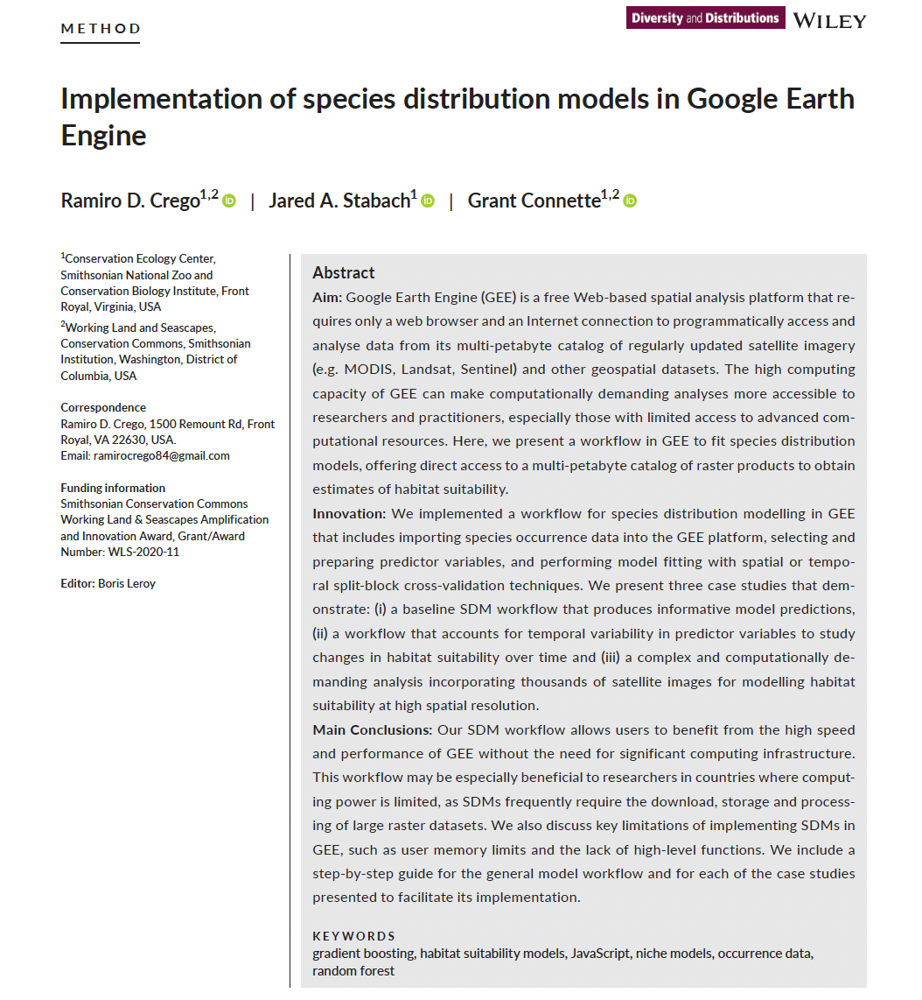</a></figure>

We first cover the basics of using matchine learning to create a simple species distribution model. We then cover more specifics of the SDM workflow for importing data and setting the main arguments used in different functions, such as, grid size and the area of interest. We then expand on different modelling workflows using three different case studies to demonstrate how to adapt the code workflow for different goals.

The code of the original paper can be be accessed through the [GEE](https://earthengine.google.com/) repository for
this study:
<https://code.earthengine.google.com/?accept_repo=users/ramirocrego84/SDM_Manuscript>

You can download the power point associated with this module from [here](https://drive.google.com/file/d/1tXkwH9qIuF_xMrp_0e1wvesALK5YlGFP/view?usp=sharing)

### Importing species location data as an asset

Datasets need to be uploaded as assets in [Google Earth Engine](https://earthengine.google.com/). The easiest way to do this is by creating a csv file with spatial coordinates and any other desired attribute information. Note that you can also upload an ESRI Shapefile with the species location data.

Below is an example for uploading the *Bradypus variegatus* data set from a `csv` file. Prepare a `csv` file with coordinates in latitude and longitude (EPSG:4326). To include a column with date use format
Year-Month-Day (e.g., 2000-01-30).

<figure>
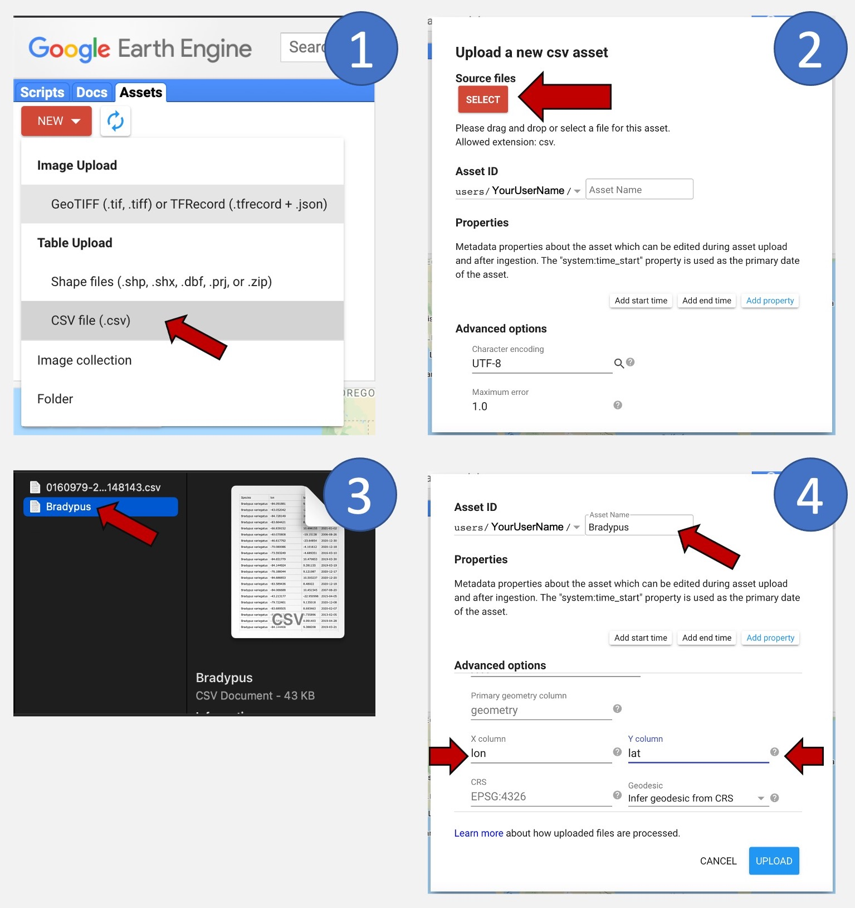
<figcaption aria-hidden="true">Figure 1. Steps for uploading assets to Google Earth Engine. 1) Click ‘New’ under the Assets tab and then select ‘CSV file (.csv)’. 2) Click ‘SELECT’. 3) Browse and select the file from your computer. 4) Provide a name for the asset and the names of the columns containing coordinates in degrees.</figcaption>
</figure>

### Loading and cleaning your species data

To import the asset into your active script you can click on the forward arrow icon on your asset manager or you can use code to programmatically load the data as a new object. We recommend using code to import data. To import the asset with your species presence data, use the `ee.FeatureCollection()` function and provide the asset ID. For example:

```{js, eval=F}
var Data = ee.FeatureCollection('users/yourfolder/yourdata');
```

One important step in modeling species distributions is to limit the potential effect of geographic sampling bias on the model output due to data aggregation resulting from multiple nearby observations.

We thin the location data to one randomly selected occurrence record per pixel at the chosen spatial resolution (the raster pixel or grain size of the analysis).

Here, we will apply a function to remove all points that lay within the same raster cell at a given grain size. For this, we first need to define the spatial resolution of our study.

```{js, eval=F}
// Define spatial resolution to work with (m)
var GrainSize = 10000; // e.g. 10 km
```

Then, we can define a function to remove duplicates and apply it to the species data set.

```{js, eval=F}
function RemoveDuplicates(data){
  var randomraster = ee.Image.random().reproject('EPSG:4326', null, GrainSize);
  var randpointvals = randomraster.sampleRegions({collection:ee.FeatureCollection(data), scale: 10, geometries: true});
  return randpointvals.distinct('random');
}
var Data = RemoveDuplicates(Data);
```

The following figure exemplifies how points are rarefied at a 1 km grain size.

<figure>
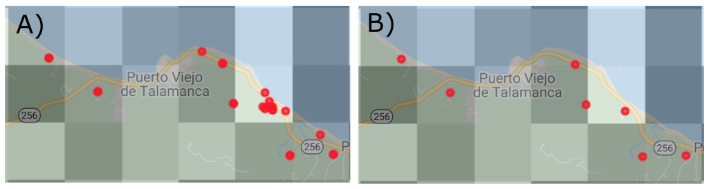
<figcaption aria-hidden="true">Figure 2. Example of presence point filtering. A) Original dataset; B) Final dataset with only one presence point retained per pixel.</figcaption>
</figure>

You can evaluate the number of points before and after removing duplicates.

```{js, eval=F}
print(ee.FeatureCollection('users/yourfolder/yourimage').size())
print(Data.size())
```

### Define your area of interest for modeling

The extent of the analysis should be carefully selected and constrained to a realistic realm of the species of study, avoiding unrealistic extents that can hamper model accuracy and predictions (Guisan et al., 2017; Leroy et al., 2018; Sillero et al., 2021).

There are different ways you can define your area of interest. You can directly draw a polygon using the drawing tools in [GEE](https://earthengine.google.com/) or manually set the polygon (e.g., Case Study 2 in this tutorial). Here, we present two methods for automating this process.

If you are interested in working with a specific country or continent, you can use the Large Scale International Boundary Polygons data set available in the [GEE](https://earthengine.google.com/) catalog.

Here an example to select Kenya:

```{js, eval=F}
// Load region boundary from data catalog if working at a larger scale
var AOI = ee.FeatureCollection('USDOS/LSIB_SIMPLE/2017').filter(ee.Filter.eq('country_co', 'KE'));
```

You can see the list of country codes at: <https://en.wikipedia.org/wiki/List_of_FIPS_country_codes>

If you are interested in working within the entire African continent, you'll need to reference the 'wld_rgn' column:

```{js, eval=F}
// Load country boundary from data catalog if working at a country scale
var AOI = ee.FeatureCollection('USDOS/LSIB_SIMPLE/2017').filter(ee.Filter.eq('wld_rgn', 'Africa'));
```

Another option is to select a bounding box around your species location data. For example, we can define a bounding box using the function `bounds()` and add a buffer of 50 km.

```{js, eval=F}
// Define the area of interest
var AOI = Data.geometry().bounds().buffer(50000);
```

To display the study area on the map use the following code and assign the map layer the name ‘AOI’:

```{js, eval=F}
// Add AOI to the map
Map.addLayer(AOI, {}, 'AOI', 1); // The number 1 indicates the zoom level. Higher numbers increases zoom level.
```

### Selecting predictor variables

One of the main advantages of implementing SDMs in [Google Earth Engine](https://earthengine.google.com/) is to make use of the large number of datasets available as predictor variables. This includes not only the bioclimatic variables from Hijmans et al. (2005), but elevation data and derivatives (slope, aspect, hillside, etc.), diverse vegetation indices, human modification indices, nighttime light images, water bodies, hourly climatic data, land cover classifications, roads or other infrastructure and even the raw pixel values of satellite data. Depending on your area of interest, certain regions have greater data availability. [GEE](https://earthengine.google.com/) also offers the opportunity to directly include user-derived datasets in your analysis, such as processed satellite imagery (e.g., a land cover classification that you previously developed for your area of interest).

Selecting predictor variables is a step in which the researcher needs to rely on existing knowledge of the study species, such as the variables that may affect its distribution, etc.

To find spatial data sets, you can use the search bar. All information related to each spatial dataset is available by clicking on the name of the product. The code necessary to import the dataset is available as shown in the following figure.

<figure>

<figcaption aria-hidden="true">Figure 3. SRTM Digital Elevation Data description with code to import the dataset</figcaption>
</figure>

```{js, eval=F}
// Example of code to import the SRTM Digital Elevation Data 30m
var Elev = ee.Image("USGS/SRTMGL1_003");
```

Note that the [GEE](https://earthengine.google.com/) function `ee.Algorithms.Terrain()` allows you to calculate slope, aspect, and hillshade from the elevation dataset.

We will demonstrate different ways to import and manipulate spatial data sets with the specific examples below.

### Defining an area to create pseudo-absences

When using presence only data, the most common methodology when using data from online databases such as, GBIF, it is important to define the area to create pseudo-absences. Choosing the proper method is a critical step as it can affect model performance (Barbet-Massin, Jiguet, Albert, & Thuiller, 2012). Here we show how to implement three different methodologies. In all three, we first create a mask of the location of the presence data to avoid randomly generating pseudo-absences at the same pixels as presences.

-   Note: The mask to remove presence point locations from the area to create pseudo-absences has a code problem that is now fixed. Also see Study Case 1 on how to mask out water if your area of interest includes areas over water.

1.  Generate random pseudo-absences across the entire study area.

```{js, eval=F}
// Make an image out of the presence locations. The pixels where we have presence locations will be removed from the area to generate pseudo-absences.
// This will prevent having presence and pseudo-absences in the same pixel. 
var mask = Data
  .reduceToImage({
    properties: ['random'],
    reducer: ee.Reducer.first()
}).reproject('EPSG:4326', null, ee.Number(GrainSize)).mask().neq(1).selfMask();

var AreaForPA = mask.clip(AOI);
```

2.  Generate pseudo-absences within a specified distance from presence locations to limit pseudo-absences to areas potentially accessible to the species (Araújo et al., 2019) and to account for the potential geographical or environmental sampling bias of presence records by creating pseudo-absences with a similar sampling bias (Phillips et al., 2009). The `buffer()` function determines the area available for generating pseudo-absences, assuming that these areas have the same sampling bias than the records and represent areas where animals can disperse. The `buffer()` function has two arguments, the distance in meters for the buffer and the maximum amount of error tolerated when approximating the buffer circle. Larger maximum errors improve computing efficiency.

```{js, eval=F}
    // Make an image out of the presence locations. The pixels where we have presence locations will be removed from the area to generate pseudo-absences.
    // This will prevent having presence and pseudo-absences in the same pixel. 
    var mask = Data
      .reduceToImage({
        properties: ['random'],
        reducer: ee.Reducer.first()
    }).reproject('EPSG:4326', null, ee.Number(GrainSize)).mask().neq(1).selfMask();

    // Option 2: Spatially constrained pseudo-absence selection to a buffer around presence points.
    var buffer = 500000; // Distance in meters.
    var AreaForPA = Data.geometry().buffer(buffer, 1000);
    var AreaForPA = mask.clip(AreaForPA).clip(AOI);
    right.addLayer(AreaForPA, {},'Area to create pseudo-absences', 0);
```

3.  Limit the area to select pseudo-absences by implementing an environmental profiling technique, masking out the known environmentally suitable locations, similar to other two-steps methods for generating pseudo-absences (Chefaoui & Lobo, 2008; Senay, Worner, & Ikeda, 2013).

This method requires fitting a clustering function to the occurrence data. When you have a large presence dataset, you can randomly choose a subset of the data with this line of code: `Data.randomColumn().sort('random').limit(200)` where the number in `limit()` specifies the number of random presence points used to train the clustering algorithm. A critical step is to display the cluster results and identify the correct cluster, zero or one, to use for creation of pseudo-absences. The cluster ID is assigned in an inconsistent manner and can change even when changing the order of the same data input. We wrote a line of code to automatically identify the cluster ID to define the area to create pseudo-absences. But it is important to display the cluster results and confirm that the clustering worked properly and that the correct cluster ID was identified before creating the mask: `var mask2 = Clresult.select(['cluster']).eq(clustID)`.

```{js, eval=F}
// Make an image out of the presence locations. The pixels where we have presence locations will be removed from the area to generate pseudo-absences.
// This will prevent having presence and pseudo-absences in the same pixel. 
var mask = Data
  .reduceToImage({
    properties: ['random'],
    reducer: ee.Reducer.first()
}).reproject('EPSG:4326', null, ee.Number(GrainSize)).mask().neq(1).selfMask();

//Option 3: Environmental pseudo-absences selection (environmental profiling)
// Extract environmental values for a random subset of presence data
var PixelVals = predictors.sampleRegions({collection: Data.randomColumn().sort('random').limit(200), properties: [], tileScale: 16, scale: GrainSize});
// Perform k-means clustering based on Euclidean distance.
var clusterer = ee.Clusterer.wekaKMeans({nClusters:2, distanceFunction:"Euclidean"}).train(PixelVals);
// Assign pixels to clusters using the trained clusterer.
var Clresult = predictors.cluster(clusterer);
// Display cluster results and identify the cluster IDs for pixels similar and dissimilar to the presence data
Map.addLayer(Clresult.randomVisualizer(), {}, 'Clusters', 0);
// Mask pixels that are dissimilar to the presence data.
// Obtain the ID of the cluster similar to the presence data and use the opposite cluster to define the allowable area to for creating pseudo-absences.
var clustID = Clresult.sampleRegions({collection: Data.randomColumn().sort('random').limit(200), properties: [], tileScale: 16, scale: GrainSize});
clustID = ee.FeatureCollection(clustID).reduceColumns(ee.Reducer.mode(),['cluster']);
clustID = ee.Number(clustID.get('mode')).subtract(1).abs();
var mask2 = Clresult.select(['cluster']).eq(clustID);
var AreaForPA = mask.updateMask(mask2).clip(AOI);

// Display area for creation of pseudo-absence
Map.addLayer(AreaForPA, {},'Area to create pseudo-absences', 0);
```

---

### Case Study 1: A simple example to understand how matchine learning works

The code to run this case study can be found [here](https://code.earthengine.google.com/c715efb63af0422065036c34bbf4d649) 

Let's start running a very simple SDM using a Random Forest algorithm. To do this, we will use a dataset on Plains zebra (**Equus quagga**) observations downloaded from [GBIF](https://www.gbif.org/). 

First, we will define a polygon around the African continent that will serve as the area of interest (AOI). You can use the drawing tools to do this. It does not have to be accurate for this simple example.

```{js, eval=F}
// Define AOI
var AOI = geometry
```

Now we can load the 1593 zebra observations across Africa. We will not worry about data quality for now as we just want to demonstrate how SDMs work. You should, however, consider data quality when conducting an analysis in practice.

```{js, eval=F}
// Load Zebra data
var Data = ee.FeatureCollection('projects/ee-ramirocrego84/assets/PlainZebra')
print(Data.size())
```

Next, we need to define a grain size to work with, the spatial resolution of the analysis. We will use a coarse resolution to work at the continental level of 10 x 10 km (10000 x 10000 m). Grain size impacts the speed of processing (smaller grain sizes require more compute resources) and the detail of the result (larger grain sizes will provide less detail).

```{js, eval=F}
// Define spatial resolution to work with (m)
var GrainSize = 10000;

```

Next, we want to remove all points that lay within the same raster cell at a given grain size.

```{js, eval=F}
function RemoveDuplicates(data){
  var randomraster = ee.Image.random().reproject('EPSG:4326', null, GrainSize);
  var randpointvals = randomraster.sampleRegions({collection:ee.FeatureCollection(data), scale: 10, geometries: true});
  return randpointvals.distinct('random');
}

var Data = RemoveDuplicates(Data);
print('Final data size:', Data.size());
```

Next, we will load a set of predictor variables. We will use an elevation model and the 19 bioclimatic variables available on [GEE](https://earthengine.google.com/). We will display annual mean temperature as an example.

```{js, eval=F}
// Load elevation data from the data catalog and clip it to the country boundary
var Elev = ee.Image("USGS/SRTMGL1_003");

// Import WORLDCLIM climate data
var bio = ee.Image('WORLDCLIM/V1/BIO');

// Combine predictor variables into a single multi-band image
var predictors = Elev.addBands(bio).clip(AOI);
print(predictors)
Map.addLayer(predictors,{bands: ['bio01'], min:0, max:300, palette: ['yellow','green']}, 'Temp');
```

So far we have the presence data and the predictor variables. To fit a model we also need pseudo-absences - points that provide information on areas where we do not have zebra locations. This can be a complex and crucial step and we will discuss more in the next example. For now, we will just create random points across the entire continent. Note, we need to add a condition (i.e., a flag) to the data indicating which ones are presence with a 1 and which ones are pseudo-absences with a 0.

```{js, eval=F}
// Presence
var PresencePoints = Data.map(function(feature){return feature.set('PresAbs', 1)});

// Pseudo-absences
var PseudoAbsPoints = predictors.sample({region: AOI, scale: GrainSize, numPixels: 1600, geometries: true, tileScale: 16}); // We add extra points to account for those points that land in masked areas of the raster and are discarded. This ensures a balanced presence/pseudo-absence data set
PseudoAbsPoints = PseudoAbsPoints.map(function(feature){return feature.set('PresAbs', 0);});

var CombinedPoints = PresencePoints.merge(PseudoAbsPoints)
```

Now that we have a complete dataset with presence and pseudo-absences, we need to extract the pixel value of each predictor variable at each location.

```{js, eval=F}
// Extract pixel values
var trainPixelsVals = predictors.sampleRegions({collection:CombinedPoints, properties:['PresAbs'], scale: GrainSize});
```

We also create a variable that contains the band names.

```{js, eval=F}
var Bands = predictors.bandNames();
```

We now have all the ingredients to fit a Random Forest matchine learning model and predict across the AOI the distribution of zebras.

```{js, eval=F}
// Classify using Random Forest
var rfClassifier = ee.Classifier.smileRandomForest(100).train(trainPixelsVals, 'PresAbs', Bands);
var rfClassified = predictors.classify(rfClassifier);
```

Finally, we can display the result.

```{js, eval=F}
// Add final habitat suitability layer to the map
Map.addLayer(rfClassified, {
  palette: ["#440154FF","#DCE319FF"], 
  min: 0, 
  max: 1 
}, 'Habitat Suitability');
```

Despite the simplicity of this model, we can see that the predicted distribution is not too far off from the actual distribution of Plains zebras.

<figure>
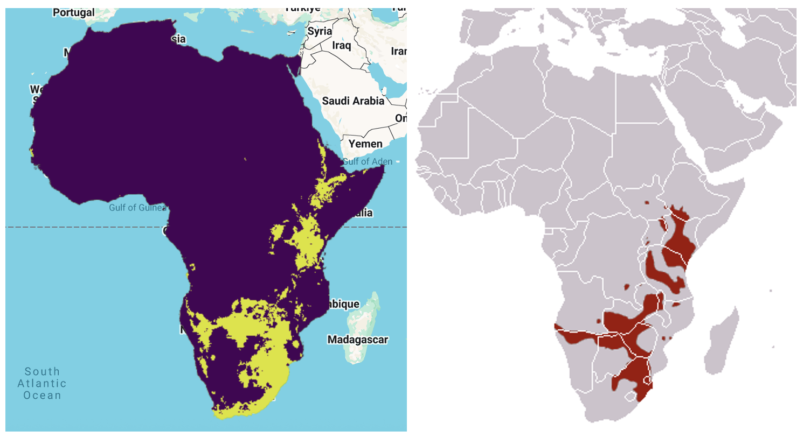
<figcaption aria-hidden="true">Figure 4. Estimated distribution of Plains zebra vs known distribution.</figcaption>
</figure>


---

### Case Study 2: Modeling *Bradypus variegatus* habitat suitability and predicted distribution using presence-only data

The code to run this case study can be found [here](https://code.earthengine.google.com/2347905e2f31d47fd985fbf9c9bd75b7) 

To demonstrate the basic code to conduct SDMs in [Google Earth Engine](https://earthengine.google.com/), we will use *Bradypus variegatus* as a case study. This species has been widely used to present other SDM software and [R](https://cran.r-project.org/) packages (Hijmans et al., 2017; Kindt, 2018; Phillips et al., 2017, 2006) and allows us to compare [GEE](https://earthengine.google.com/) outputs with other tools. We obtained occurrence data from GBIF (GBIF.org 20 January 2021 GBIF Occurrence Download <https://doi.org/10.15468/dl.jxcv7e>). We filtered data to the period from 2000 to 2020, retaining only georeferenced records with a coordinate uncertainty &lt; 250 m. We further cleaned the data set by removing all locations that fall on top of buildings or water bodies assuming they had incorrect coordinates.

### Loading species location data

We upload the presence data set, specify the spatial scale to work with and randomly select one occurrence location per 1km grid cell.

Note that the following code modifies the `ui.root` to display two maps on the map panel of the user interface, one for the habitat suitability map and one for the potential distribution map.

```{js, eval=F}
///////////////////////////////
// Section 1 - Species data
///////////////////////////////

// Load presence data
var Data = ee.FeatureCollection('users/ramirocrego84/BradypusVariegatus');
print('Original data size:', Data.size());

// Define spatial resolution to work with (m)
var GrainSize = 1000;

function RemoveDuplicates(data){
  var randomraster = ee.Image.random().reproject('EPSG:4326', null, GrainSize);
  var randpointvals = randomraster.sampleRegions({collection:ee.FeatureCollection(data), scale: 10, geometries: true});
  return randpointvals.distinct('random');
}

var Data = RemoveDuplicates(Data);
print('Final data size:', Data.size());

// Add two maps to the screen.
var left = ui.Map();
var right = ui.Map();
ui.root.clear();
ui.root.add(left);
ui.root.add(right);

// Link maps, so when you drag one map, the other will be moved in sync.
ui.Map.Linker([left, right], 'change-bounds');

// Visualize presence points on the map
//right.addLayer(Data, {color:'red'}, 'Presence', 1);
//left.addLayer(Data, {color:'red'}, 'Presence', 1);
```


<figure>
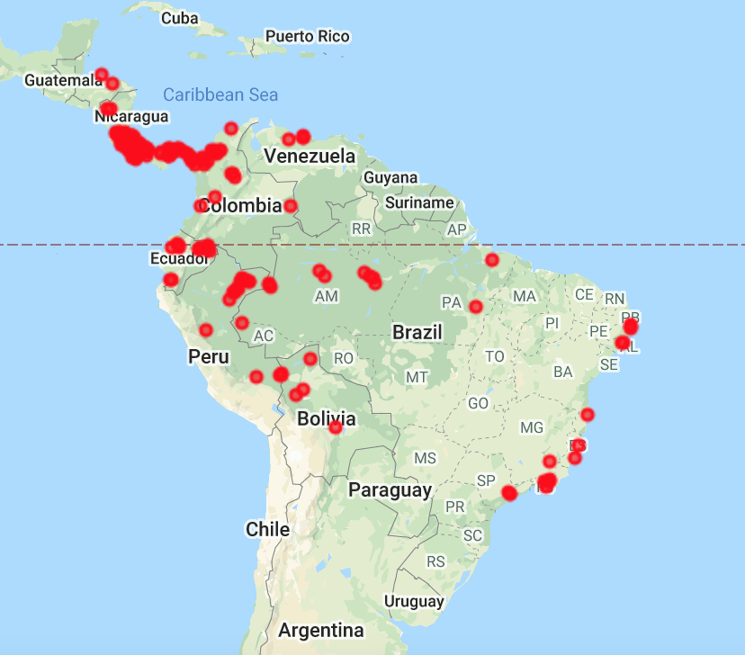
<figcaption aria-hidden="true">Figure 5. Presence data for Bradypus
variegatus. Data were obtained from GBIF.</figcaption>
</figure>

### Defining the area of interest

The next step is to define the extent of the area of interest. Here we defined a 100 km buffer around the bounding box containing all presence data. The argument for the buffer distance is in meters.

```{js, eval=F}
////////////////////////////////////////////
// Section 2 - Define Area of Interest
////////////////////////////////////////////

// Define the AOI
var AOI = Data.geometry().bounds().buffer({distance:50000, maxError:1000});

// Add border of study area to the map
var outline = ee.Image().byte().paint({
  featureCollection: AOI, color: 1, width: 3});
right.addLayer(outline, {palette: 'FF0000'}, "Study Area");
left.addLayer(outline, {palette: 'FF0000'}, "Study Area");

// Center each map to the area of interest
right.centerObject(AOI, 4); //Number indicates the zoom level
left.centerObject(AOI, 4); //Number indicates the zoom level
```

> Note that in the code we are using right and left instead of the
> default Map statement now that we have divided the interactive map
> into two elements, ‘right’ and ‘left’.

<figure>
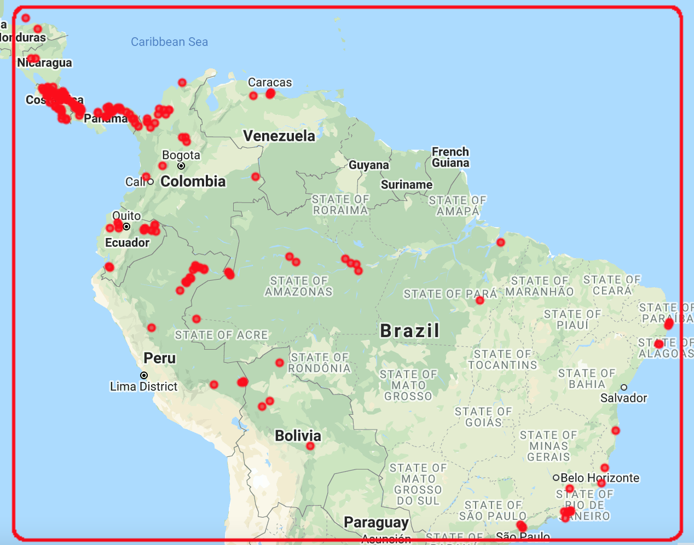
<figcaption aria-hidden="true">Figure 6. This figure shows the area of
interest, which was defined as a 100 km buffer around the bounding box
containing all presence locations.</figcaption>
</figure>

### Loading predictor variables

For this example, we selected a combination of climatic predictor variables (temperature seasonality, maximum temperature of warmest month, minimum temperature of coldest month and annual precipitation) obtained from (Hijmans et al. 2005), elevation (Farr et al. 2007) and percentage tree cover at 250 m resolution obtained from the Terra MODIS
Vegetation Continuous Fields (VCF) product. The VCF product is generated yearly and produced using monthly composites of Terra MODIS Land Surface Reflectance data. We estimated mean percentage tree cover for the period of the occurrence data, 2003 to 2020. All predictor variables ultimately need to be combined as bands into a single multi-band image. We also mask oceans from the multi-band predictor image.

The calculation of the median percentage tree cover for each pixel across the annual MODIS images shows how powerful Google Earth Engine can be for raster processing when creating predictor variables.

```{js, eval=F}
////////////////////////////////////////////////
// Section 3 - Selecting Predictor Variables
////////////////////////////////////////////////

// Load WorldClim BIO Variables (a multiband image) from the data catalog
var BIO = ee.Image("WORLDCLIM/V1/BIO");

// Load elevation data from the data catalog and calculate slope, aspect, and a simple hillshade from the terrain Digital Elevation Model.
var Terrain = ee.Algorithms.Terrain(ee.Image("USGS/SRTMGL1_003"));

// Load NDVI 250 m collection and estimate median annual tree cover value per pixel
var MODIS = ee.ImageCollection("MODIS/006/MOD44B");
var MedianPTC = MODIS.filterDate('2003-01-01', '2020-12-31').select(['Percent_Tree_Cover']).median();

// Combine bands into a single multi-band image
var predictors = BIO.addBands(Terrain).addBands(MedianPTC);

// Mask out ocean pixels from the predictor variable image
var watermask =  Terrain.select('elevation').gt(0); //Create a water mask
var predictors = predictors.updateMask(watermask).clip(AOI);

// Select subset of bands to keep for habitat suitability modeling
var bands = ['bio04','bio05','bio06','bio12','elevation','Percent_Tree_Cover'];
var predictors = predictors.select(bands);

// Display layers on the map
right.addLayer(predictors, {bands:['elevation'], min: 0, max: 5000,  palette: ['000000','006600', '009900','33CC00','996600','CC9900','CC9966','FFFFFF',]}, 'Elevation (m)', 0);
right.addLayer(predictors, {bands:['bio05'], min: 190, max: 400, palette:'white,red'}, 'Temperature seasonality', 0); 
right.addLayer(predictors, {bands:['bio12'], min: 0, max: 4000, palette:'white,blue'}, 'Annual Mean Precipitation (mm)', 0); 
right.addLayer(predictors, {bands:['Percent_Tree_Cover'], min: 1, max: 100, palette:'white,yellow,green'}, 'Percent_Tree_Cover', 0); 
```

<figure>
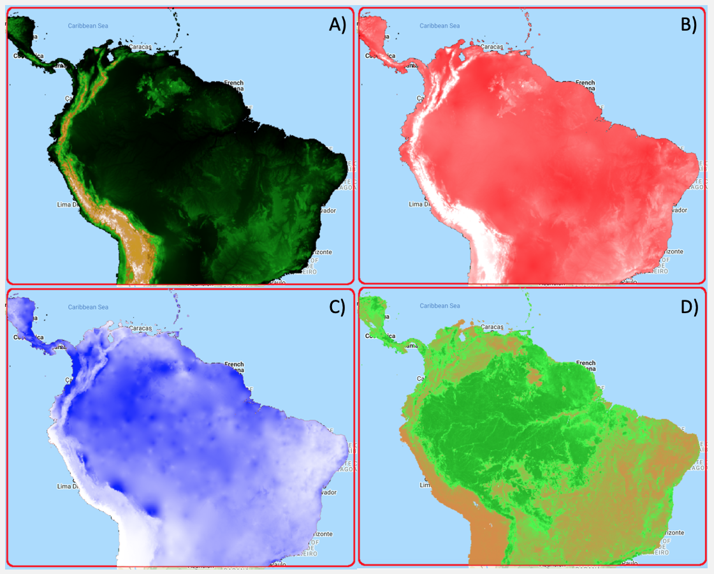
<figcaption aria-hidden="true">Figure 7. Examples of predictor
variables. A) Elevation; B) Temperature seasonality; C) Annual
precipitation; D) Median percentage of tree cover between 2003 and
2020.</figcaption>
</figure>

It is important to make sure that there is no significant correlation amongst predictor variables that can cause collinearity. We account for this by estimating the Spearman correlation among predictor variable values at 5000 random locations. Highly correlated predictor variables should not be included in the same model.

```{js, eval=F}
// Estimate correlation among predictor variables

// Extract local covariate values from multi-band predictor image at 5000 random points
var DataCor = predictors.sample({scale: GrainSize, numPixels: 5000, geometries: true}); //Generate 5000 random points
var PixelVals = predictors.sampleRegions({collection: DataCor, scale: GrainSize, tileScale: 16}); //Extract covariate values

// To check all pairwise correlations we need to map the reduceColumns function across all pairwise combinations of predictors
var CorrAll = predictors.bandNames().map(function(i){
    var tmp1 = predictors.bandNames().map(function(j){
      var tmp2 = PixelVals.reduceColumns({
        reducer: ee.Reducer.spearmansCorrelation(),
        selectors: [i, j]
      });
    return tmp2.get('correlation');
    });
    return tmp1;
  });
print('Variables correlation matrix',CorrAll);
```

> This is a function that requires a lot of memory in GEE as it is working with a large feature collection. Once you have run the correlation code and selected the final set of covariables to use, it is recommended to comment out the print function so the correlations between predictor variables are not run repeatedly.

### Creating pseudo-absences

In this example, we use presence only data, the most common methodology when using data from online databases such as GBIF. We will generate pseudo-absences to fit the model. But first, we need to define the area in which random pseudo-absences can be generated.

We used a two-step environmental profiling approach to restrict the area for the creation of pseudo-absences. We first performed a k-means clustering based on Euclidean distance for the presence data and then created random pseudo-absences within the pixels classified as being more dissimilar to the presence data.

```{js, eval=F}
////////////////////////////////////////////////////////////////////////////////////////////////////////
// Section 4 - Defining area for pseudo-absences and spatial blocks for model fitting and cross validation
////////////////////////////////////////////////////////////////////////////////////////////////////////

// Make an image out of the presence locations. The pixels where we have presence locations will be removed from the area to generate pseudo-absences.
// This will prevent having presence and pseudo-absences in the same pixel. 
var mask = Data
  .reduceToImage({
    properties: ['random'],
    reducer: ee.Reducer.first()
}).reproject('EPSG:4326', null, ee.Number(GrainSize)).mask().neq(1).selfMask();

// Option 1: Simple random pseudo-absence selection across the entire area of interest.
// var AreaForPA = mask.updateMask(watermask).clip(AOI);

// Option 2: Spatially constrained pseudo-absence selection to a buffer around presence points.
//var buffer = 500000; // Distance in meters.
//var AreaForPA = Data.geometry().buffer({distance:buffer, maxError:1000});
//var AreaForPA = mask.clip(AreaForPA).updateMask(watermask).clip(AOI);
//right.addLayer(AreaForPA, {},'Area to create pseudo-absences', 0);

//Option 3: Environmental pseudo-absences selection (environmental profiling)
// Extract environmental values for the a random subset of presence data
var PixelVals = predictors.sampleRegions({collection: Data.randomColumn().sort('random').limit(200), properties: [], tileScale: 16, scale: GrainSize});
// Perform k-means clusteringthe clusterer and train it using based on Eeuclidean distance.
var clusterer = ee.Clusterer.wekaKMeans({nClusters:2, distanceFunction:"Euclidean"}).train(PixelVals);
// Assign pixels to clusters using the trained clusterer
var Clresult = predictors.cluster(clusterer);
// Display cluster results and identify the cluster IDs for pixels similar and dissimilar to the presence data
right.addLayer(Clresult.randomVisualizer(), {}, 'Clusters', 0);
// Mask out pixels that are dissimilar to presence data.
// Obtain the ID of the cluster similar to the presence data and use the opposite cluster to define the allowable area to for creatinge pseudo-absences
var clustID = Clresult.sampleRegions({collection: Data.randomColumn().sort('random').limit(200), properties: [], tileScale: 16, scale: GrainSize});
clustID = ee.FeatureCollection(clustID).reduceColumns(ee.Reducer.mode(),['cluster']);
clustID = ee.Number(clustID.get('mode')).subtract(1).abs();
var mask2 = Clresult.select(['cluster']).eq(clustID);
var AreaForPA = mask.updateMask(mask2).clip(AOI);

// Display area for creation of pseudo-absence
right.addLayer(AreaForPA, {palette: 'black'},'Area to create pseudo-absences', 0);
```

<figure>
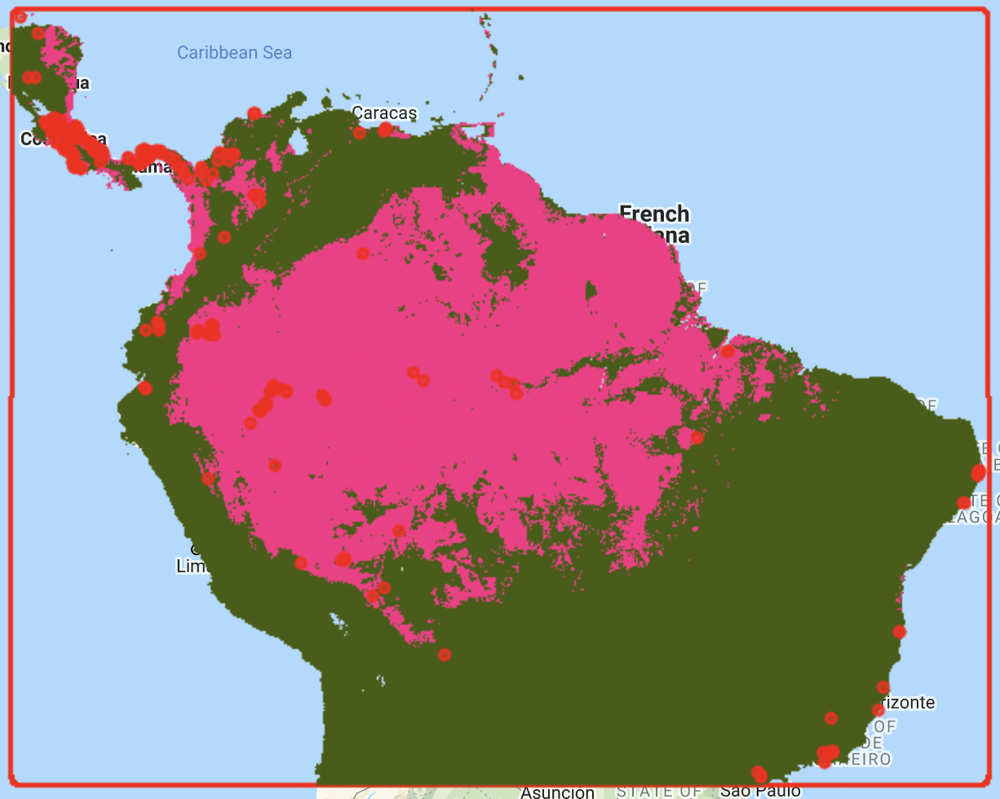
<figcaption aria-hidden="true">Figure 8a. Results from cluster analysis.</figcaption>
</figure>

<figure>
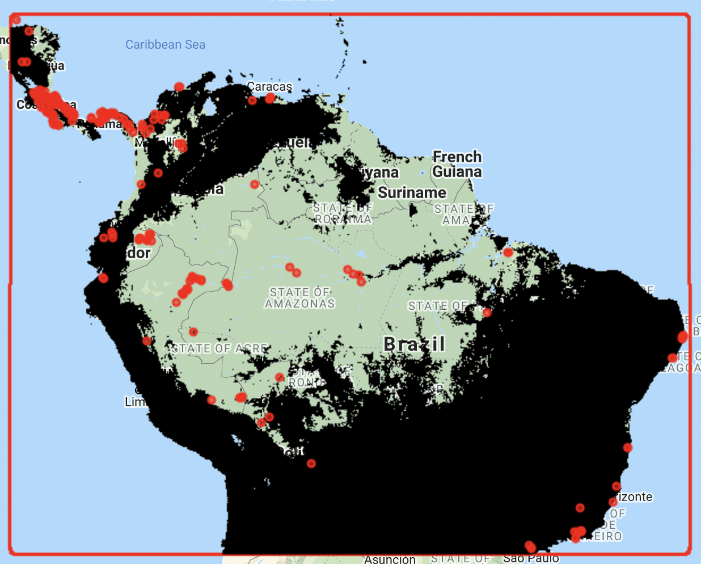
<figcaption aria-hidden="true">Figure 8b. Area to create pseudo-absences.</figcaption>
</figure>

For this case study, we implement a block repeated split-sample cross-validation technique to randomly partition data for model training and validation (Roberts et al., 2017; Valavi, Elith, Lahoz-Monfort, & Guillera-Arroita, 2019). We then run multiple model iterations with random block splits to create training and validation data sets.

The argument `scale` determines the range in m for each block. In this case, we are using 200 km.

```{js, eval=F}
// Define a function to create a grid over AOI
function makeGrid(geometry, scale) {
  // pixelLonLat returns an image with each pixel labeled with longitude and
  // latitude values.
  var lonLat = ee.Image.pixelLonLat();
  // Select the longitude and latitude bands, multiply by a large number then
  // truncate them to integers.
  var lonGrid = lonLat
    .select('longitude')
    .multiply(100000)
    .toInt();
  var latGrid = lonLat
    .select('latitude')
    .multiply(100000)
    .toInt();
  return lonGrid
    .multiply(latGrid)
    .reduceToVectors({
      geometry: geometry.buffer({distance:20000,maxError:1000}), //The buffer allows you to make sure the grid includes the borders of the AOI.
      scale: scale,
      geometryType: 'polygon',
    });
}
// Create grid and remove cells outside AOI
var Scale = 200000; // Set range in m to create spatial blocks
var grid = makeGrid(AOI, Scale);
var Grid = watermask.reduceRegions({collection: grid, reducer: ee.Reducer.mean()}).filter(ee.Filter.neq('mean',null));
right.addLayer(Grid, {},'Grid for spatil block cross validation', 0);
```

<figure>
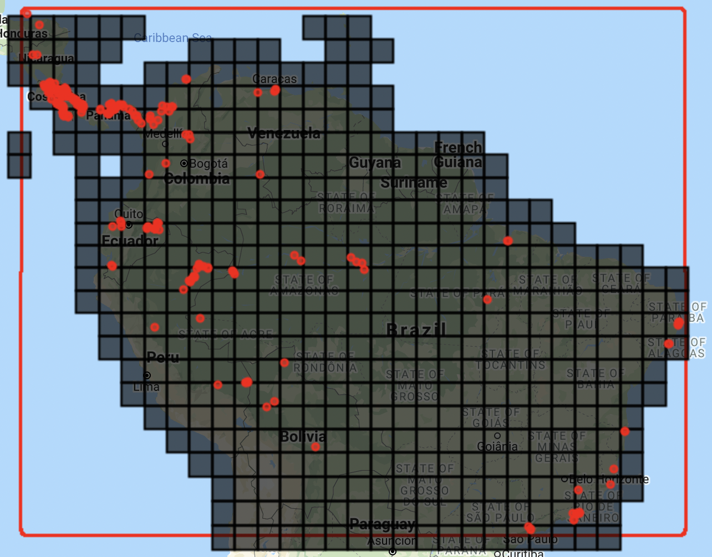
<figcaption aria-hidden="true">Figure 9. Visualization of blocks
created for cross validation.</figcaption>
</figure>

### Model fit, model validation and model predictions

We can now fit the models. There are several functions that need to be defined.

The first function allows us to create random seeds for splitting spatial blocks and generating pseudo-absences at each iteration.

```{js, eval=F}
//////////////////////////////////
// Section 5 - Fitting SDM models
//////////////////////////////////

// Define function to generate a vector of random numbers between 1 and 1000
function runif(length) {
    return Array.apply(null, Array(length)).map(function() {
        return Math.round(Math.random() * (1000 - 1) + 1)
    });
}
```

We need to define a function to fit models.

There are several non-parametric classification algorithms available in [GEE](https://earthengine.google.com/) that can be implemented. These include random forest, support vector machine, classification and regression trees, maximum entropy, and gradient boosting.

We implement a 10 block repeated split-sample cross-validation technique. The number of pseudo-absences is balanced with the number of presences for the training and validation data sets, as this practice is recommended for machine learning classifiers (Evans et al., 2011; Barbet-Massin et al. 2012). In this case, we will use random forest. But
note that in the `SDM` function, we also provide the code to fit gradient boosting classifiers. To change the classifier, you need to comment out the random forest function call using two forward slashes (`//`) and activate the gradient boosting classifier.

We use the `setOutputMode()` function to obtain results as `PROBABILITY` and as `CLASSIFICATION`. This allows us to obtain a binary output (i.e., predicted presence) to quickly visualize in the interactive map. Later we will show how to define a threshold to transform the probability output into a binary map.

At each iteration, the spatial blocks will be randomly split into 70% for model fitting and 30% for model validation, respectively. Consequently, each of the 10 runs will have a different set of presence and pseudo-absence points for model fitting and validation.

```{js, eval=F}
// Define SDM function
// Activate the desired classifier, random forest or gradient boosting. 
// Note that other algorithms are available in GEE. See ee.Classifiers on the documentation for more information.

function SDM(x) {
    var Seed = ee.Number(x);
    
    // Randomly split blocks for training and validation
    var GRID = ee.FeatureCollection(Grid).randomColumn({seed:Seed}).sort('random');
    var TrainingGrid = GRID.filter(ee.Filter.lt('random', split));  // Filter points with 'random' property < split percentage
    var TestingGrid = GRID.filter(ee.Filter.gte('random', split));  // Filter points with 'random' property >= split percentage

    // Presence
    var PresencePoints = ee.FeatureCollection(Data);
    PresencePoints = PresencePoints.map(function(feature){return feature.set('PresAbs', 1)});
    var TrPresencePoints = PresencePoints.filter(ee.Filter.bounds(TrainingGrid));  // Filter presence points for training 
    var TePresencePoints = PresencePoints.filter(ee.Filter.bounds(TestingGrid));  // Filter presence points for testing
    
    // Pseudo-absences
    var TrPseudoAbsPoints = AreaForPA.sample({region: TrainingGrid, scale: GrainSize, numPixels: TrPresencePoints.size().add(300), seed:Seed, geometries: true}); // We add extra points to account for those points that land in masked areas of the raster and are discarded. This ensures a balanced presence/pseudo-absence data set
    TrPseudoAbsPoints = TrPseudoAbsPoints.randomColumn().sort('random').limit(ee.Number(TrPresencePoints.size())); //Randomly retain the same number of pseudo-absences as presence data 
    TrPseudoAbsPoints = TrPseudoAbsPoints.map(function(feature){
        return feature.set('PresAbs', 0);
        });
    
    var TePseudoAbsPoints = AreaForPA.sample({region: TestingGrid, scale: GrainSize, numPixels: TePresencePoints.size().add(100), seed:Seed, geometries: true}); // We add extra points to account for those points that land in masked areas of the raster and are discarded. This ensures a balanced presence/pseudo-absence data set
    TePseudoAbsPoints = TePseudoAbsPoints.randomColumn().sort('random').limit(ee.Number(TePresencePoints.size())); //Randomly retain the same number of pseudo-absences as presence data 
    TePseudoAbsPoints = TePseudoAbsPoints.map(function(feature){
        return feature.set('PresAbs', 0);
        });

    // Merge presence and pseudo-absencepoints
    var trainingPartition = TrPresencePoints.merge(TrPseudoAbsPoints);
    var testingPartition = TePresencePoints.merge(TePseudoAbsPoints);

    // Extract local covariate values from multiband predictor image at training points
    var trainPixelVals = predictors.sampleRegions({collection: trainingPartition, properties: ['PresAbs'], scale: GrainSize, tileScale: 16, geometries: true});

    // Classify using random forest
    var Classifier = ee.Classifier.smileRandomForest({
       numberOfTrees: 500, //The number of decision trees to create.
       variablesPerSplit: null, //The number of variables per split. If unspecified, uses the square root of the number of variables.
       minLeafPopulation: 10,//Only create nodes whose training set contains at least this many points. Integer, default: 1
       bagFraction: 0.5,//The fraction of input to bag per tree. Default: 0.5.
       maxNodes: null,//The maximum number of leaf nodes in each tree. If unspecified, defaults to no limit.
       seed: Seed//The randomization seed.
      });
    
    // Classify using a gradient boosting
    // var ClassifierPr = ee.Classifier.smileGradientTreeBoost({
    //   numberOfTrees:500, //The number of decision trees to create.
    //   shrinkage: 0.005, //The shrinkage parameter in (0, 1) controls the learning rate of procedure. Default: 0.005
    //   samplingRate: 0.7, //The sampling rate for stochastic tree boosting. Default 0.07
    //   maxNodes: null, //The maximum number of leaf nodes in each tree. If unspecified, defaults to no limit.
    //   loss: "LeastAbsoluteDeviation", //Loss function for regression. One of: LeastSquares, LeastAbsoluteDeviation, Huber.
    //   seed:Seed //The randomization seed.
    // });
  
    // Presence probability 
    var ClassifierPr = Classifier.setOutputMode('PROBABILITY').train(trainPixelVals, 'PresAbs', bands); 
    var ClassifiedImgPr = predictors.select(bands).classify(ClassifierPr);
    
    // Binary presence/absence map
    var ClassifierBin = Classifier.setOutputMode('CLASSIFICATION').train(trainPixelVals, 'PresAbs', bands); 
    var ClassifiedImgBin = predictors.select(bands).classify(ClassifierBin);
   
    return ee.List([ClassifiedImgPr, ClassifiedImgBin, trainingPartition, testingPartition]);
}
```

Now we need to define some parameters before executing the SDM function. A variable with the percentage for data split, and a variable with the number of iterations to run.

```{js, eval=F}
// Define partition for training and testing data
var split = 0.70;  // // The proportion of the blocks used to select training data

// Define number of repetitions
var numiter = 10;
```

We can now map the model function. Instead of generating random numbers, we will manually set 10 random numbers for reproducibility of results. The length of the list of random seeds determines the number of iterations of model fitting and validation to run, with each iteration having a different set of presence and pseudo-absence points.

```{js, eval=F}
// Fit SDM 
//var RanSeeds = runif(numiter)
//var results = ee.List(RanSeeds).map(SDM)

// While the runif function can be used to generate random seeds, we map the SDM function over random created numbers for reproducibility of results
var results = ee.List([35,68,43,54,17,46,76,88,24,12]).map(SDM);

// Extract results from list
var results = results.flatten();
//print(results); //Activate this line to visualize all elements
```

Now we can extract the model predictions and display them on the maps. Note that we will also create some legends for each map.

```{js, eval=F}
///////////////////////////////////////////////////////////////////
// Section 6 - Extracting and displaying model prediction results
///////////////////////////////////////////////////////////////////

// Habitat suitability

// Set visualization parameters
var visParams = {
  min: 0,
  max: 1,
  palette: ["#440154FF","#482677FF","#404788FF","#33638DFF","#287D8EFF",
  "#1F968BFF","#29AF7FFF","#55C667FF","#95D840FF","#DCE319FF"],
};

// Extract all model predictions
var images = ee.List.sequence(0,ee.Number(numiter).multiply(4).subtract(1),4).map(function(x){
  return results.get(x)});

// You can add all the individual model predictions to the map. The number of layers to add will depend on how many iterations you selected.

// left.addLayer(ee.Image(images.get(0)), visParams, 'Run1');
// left.addLayer(ee.Image(image.get(1)), visParams, 'Run2');

// Calculate mean of all individual model runs
var ModelAverage = ee.ImageCollection.fromImages(images).mean();

// Add final habitat suitability layer and presence locations to the map
left.addLayer(ModelAverage, visParams, 'Habitat Suitability');
left.addLayer(Data, {color:'red'}, 'Presence', 1);

// Create legend for habitat suitability map.
var legend = ui.Panel({style: {position: 'bottom-left', padding: '8px 15px'}});

legend.add(ui.Label({
  value: "Habitat suitability",
  style: {fontWeight: 'bold', fontSize: '18px', margin: '0 0 4px 0', padding: '0px'}
}));

legend.add(ui.Thumbnail({
  image: ee.Image.pixelLonLat().select(0),
  params: {
    bbox: [0,0,1,0.1],
    dimensions: '200x20',
    format: 'png',
    min: 0,
    max: 1,
    palette: ["#440154FF","#482677FF","#404788FF","#33638DFF","#287D8EFF",
  "#1F968BFF","#29AF7FFF","#55C667FF","#95D840FF","#DCE319FF"]
  },
  style: {stretch: 'horizontal', margin: '8px 8px', maxHeight: '40px'},
}));

legend.add(ui.Panel({
  widgets: [
    ui.Label('Low', {margin: '0px 0px', textAlign: 'left', stretch: 'horizontal'}),
    ui.Label('Medium', {margin: '0px 0px', textAlign: 'center', stretch: 'horizontal'}),
    ui.Label('High', {margin: '0px 0px', textAlign: 'right', stretch: 'horizontal'}),
    ],layout: ui.Panel.Layout.Flow('horizontal')
}));

legend.add(ui.Panel(
  [ui.Label({value: "Presence locations",style: {fontWeight: 'bold', fontSize: '16px', margin: '4px 0 4px 0'}}),
   ui.Label({style:{color:"red",margin: '4px 0 0 4px'}, value:'◉'})],
  ui.Panel.Layout.Flow('horizontal')));

left.add(legend);


// Distribution map

// Extract all model predictions
var images2 = ee.List.sequence(1,ee.Number(numiter).multiply(4).subtract(1),4).map(function(x){
  return results.get(x)});

// Calculate mean of all indivudual model runs
var DistributionMap = ee.ImageCollection.fromImages(images2).mode();

// Add final distribution map and presence locations to the map
right.addLayer(DistributionMap, 
  {palette: ["white", "green"], min: 0, max: 1}, 
  'Potential distribution');
right.addLayer(Data, {color:'red'}, 'Presence', 1);

// Create legend for distribution map
var legend2 = ui.Panel({style: {position: 'bottom-left',padding: '8px 15px'}});
legend2.add(ui.Label({
  value: "Potential distribution map",
  style: {fontWeight: 'bold',fontSize: '18px',margin: '0 0 4px 0',padding: '0px'}
}));

var colors2 = ["green","white"];
var names2 = ['Presence', 'Absence'];
var entry2;
for (var x = 0; x<2; x++){
  entry2 = [
    ui.Label({style:{color:colors2[x],margin: '4px 0 4px 0'}, value:'██'}),
    ui.Label({value: names2[x],style: {margin: '4px 0 4px 4px'}})
  ];
  legend2.add(ui.Panel(entry2, ui.Panel.Layout.Flow('horizontal')));
}

legend2.add(ui.Panel(
  [ui.Label({value: "Presence locations",style: {fontWeight: 'bold', fontSize: '16px', margin: '0 0 4px 0'}}),
   ui.Label({style:{color:"red",margin: '0 0 4px 4px'}, value:'◉'})],
  ui.Panel.Layout.Flow('horizontal')));

right.add(legend2);
```

<figure>
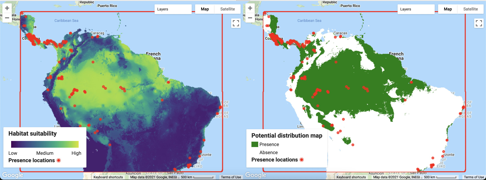
<figcaption aria-hidden="true">Figure 10. Visualization of predicted habitat suitability and potential distribution of <em>Bradypus
variegatus</em>.</figcaption>
</figure>

> It is important to understand that GEE does a resampling on the fly for displaying maps. The resolution of the model output will change with the zoom level. To set the visualization at the resolution of the analysis defined with the grain size, you need to specify the resolution of the image using the function `reproject()`.

In the next section, we will calculate the Area Under the Curve of the Receiver Operator Characteristic (AUC-ROC)(Fielding and Bell, 1997) and the Area Under the Precision-Recall Curve (AUC-PR; Sofaer, Hoeting, & Jarnevich, 2019) for each run using the validation data sets. We will then calculate the mean AUC-ROC and AUC-PR for the **n** iterations.

It is important to check that you have a sufficient number of points for model validation at each run. Because the final number of points depends on the random split of spatial blocks, you want to make sure there are enough presence and pseudo-absence points for model validation.

```{js, eval=F}
/////////////////////////////////////
// Section 7 - Accuracy assessment
/////////////////////////////////////

// Extract testing/validation data sets
var TestingDatasets = ee.List.sequence(3,ee.Number(numiter).multiply(4).subtract(1),4).map(function(x){
                      return results.get(x)});

// Double check that you have a satisfactory number of points for model validation
print('Number of presence and pseudo-absence points for model validation', ee.List.sequence(0,ee.Number(numiter).subtract(1),1)
.map(function(x){
  return ee.List([ee.FeatureCollection(TestingDatasets.get(x)).filter(ee.Filter.eq('PresAbs',1)).size(),
         ee.FeatureCollection(TestingDatasets.get(x)).filter(ee.Filter.eq('PresAbs',0)).size()]);
})
);

// Define functions to estimate sensitivity, specificity and precision at different thresholds.
function getAcc(img,TP){
  var Pr_Prob_Vals = img.sampleRegions({collection: TP, properties: ['PresAbs'], scale: GrainSize, tileScale: 16});
  var seq = ee.List.sequence({start: 0, end: 1, count: 25});
  return ee.FeatureCollection(seq.map(function(cutoff) {
  var Pres = Pr_Prob_Vals.filterMetadata('PresAbs','equals',1);
  // true-positive and true-positive rate, sensitivity  
  var TP =  ee.Number(Pres.filterMetadata('classification','greater_than',cutoff).size());
  var TPR = TP.divide(Pres.size());
  var Abs = Pr_Prob_Vals.filterMetadata('PresAbs','equals',0);
  // false-negative
  var FN = ee.Number(Pres.filterMetadata('classification','less_than',cutoff).size());
  // true-negative and true-negative rate, specificity  
  var TN = ee.Number(Abs.filterMetadata('classification','less_than',cutoff).size());
  var TNR = TN.divide(Abs.size());
  // false-positive and false-positive rate
  var FP = ee.Number(Abs.filterMetadata('classification','greater_than',cutoff).size());
  var FPR = FP.divide(Abs.size());
  // precision
  var Precision = TP.divide(TP.add(FP));
  // sum of sensitivity and specificity
  var SUMSS = TPR.add(TNR);
  return ee.Feature(null,{cutoff: cutoff, TP:TP, TN:TN, FP:FP, FN:FN, TPR:TPR, TNR:TNR, FPR:FPR, Precision:Precision, SUMSS:SUMSS});
  }));
}

// Calculate AUC of the Receiver Operator Characteristic
function getAUCROC(x){
  var X = ee.Array(x.aggregate_array('FPR'));
  var Y = ee.Array(x.aggregate_array('TPR')); 
  var X1 = X.slice(0,1).subtract(X.slice(0,0,-1));
  var Y1 = Y.slice(0,1).add(Y.slice(0,0,-1));
  return X1.multiply(Y1).multiply(0.5).reduce('sum',[0]).abs().toList().get(0);
}

function AUCROCaccuracy(x){
  var HSM = ee.Image(images.get(x));
  var TData = ee.FeatureCollection(TestingDatasets.get(x));
  var Acc = getAcc(HSM, TData);
  return getAUCROC(Acc);
}


var AUCROCs = ee.List.sequence(0,ee.Number(numiter).subtract(1),1).map(AUCROCaccuracy);
print('AUC-ROC:', AUCROCs);
print('Mean AUC-ROC', AUCROCs.reduce(ee.Reducer.mean()));


// Calculate AUC of Precision Recall Curve
function getAUCPR(roc){
  var X = ee.Array(roc.aggregate_array('TPR'));
  var Y = ee.Array(roc.aggregate_array('Precision')); 
  var X1 = X.slice(0,1).subtract(X.slice(0,0,-1));
  var Y1 = Y.slice(0,1).add(Y.slice(0,0,-1));
  return X1.multiply(Y1).multiply(0.5).reduce('sum',[0]).abs().toList().get(0);
}

function AUCPRaccuracy(x){
  var HSM = ee.Image(images.get(x));
  var TData = ee.FeatureCollection(TestingDatasets.get(x));
  var Acc = getAcc(HSM, TData);
  return getAUCPR(Acc);
}

var AUCPRs = ee.List.sequence(0,ee.Number(numiter).subtract(1),1).map(AUCPRaccuracy);
print('AUC-PR:', AUCPRs);
print('Mean AUC-PR', AUCPRs.reduce(ee.Reducer.mean()));
```

Accuracy assessment results are:

<table>
<thead>
<tr class="header">
<th>Model</th>
<th>AUC-ROC</th>
<th>AUC-PR</th>
</tr>
</thead>
<tbody>
<tr class="odd">
<td>Run 1</td>
<td>0.95</td>
<td>0.78</td>
</tr>
<tr class="even">
<td>Run 2</td>
<td>0.88</td>
<td>0.81</td>
</tr>
<tr class="odd">
<td>Run 3</td>
<td>0.79</td>
<td>0.77</td>
</tr>
<tr class="even">
<td>Run 4</td>
<td>0.96</td>
<td>0.88</td>
</tr>
<tr class="odd">
<td>Run 5</td>
<td>0.97</td>
<td>0.92</td>
</tr>
<tr class="even">
<td>Run 6</td>
<td>0.96</td>
<td>0.78</td>
</tr>
<tr class="odd">
<td>Run 7</td>
<td>0.87</td>
<td>0.82</td>
</tr>
<tr class="even">
<td>Run 8</td>
<td>0.97</td>
<td>0.91</td>
</tr>
<tr class="odd">
<td>Run 9</td>
<td>0.94</td>
<td>0.83</td>
</tr>
<tr class="even">
<td>Run 10</td>
<td>0.83</td>
<td>0.78</td>
</tr>
<tr class="odd">
<td><strong>Mean</strong></td>
<td><strong>0.91</strong></td>
<td><strong>0.83</strong></td>
</tr>
</tbody>
</table>

In the next section we will extract sensitivity (correct predictions of the occurrence) and specificity (correct predictions of the absence; Fielding & Bell, 1997). These metrics require defining a threshold. For each iteration, we use the threshold that maximizes the sum of sensitivity and specificity. This threshold has been shown to perform well with presence-only data (Liu, Newell, & White, 2016).

```{js, eval=F}
// Function to extract other metrics
function getMetrics(x){
  var HSM = ee.Image(images.get(x));
  var TData = ee.FeatureCollection(TestingDatasets.get(x));
  var Acc = getAcc(HSM, TData);
  return Acc.sort({property:'SUMSS',ascending:false}).first();
}

// Extract sensitivity, specificity and mean threshold values
var Metrics = ee.List.sequence(0,ee.Number(numiter).subtract(1),1).map(getMetrics);
print('Sensitivity:', ee.FeatureCollection(Metrics).aggregate_array("TPR"));
print('Specificity:', ee.FeatureCollection(Metrics).aggregate_array("TNR"));

var MeanThresh = ee.Number(ee.FeatureCollection(Metrics).aggregate_array("cutoff").reduce(ee.Reducer.mean()));
print('Mean threshold:', MeanThresh);
```

<table>
<thead>
<tr class="header">
<th>Model</th>
<th>Sensitivity</th>
<th>Specificity</th>
</tr>
</thead>
<tbody>
<tr class="odd">
<td>Run 1</td>
<td>0.82</td>
<td>0.94</td>
</tr>
<tr class="even">
<td>Run 2</td>
<td>1.00</td>
<td>0.63</td>
</tr>
<tr class="odd">
<td>Run 3</td>
<td>0.89</td>
<td>0.63</td>
</tr>
<tr class="even">
<td>Run 4</td>
<td>0.93</td>
<td>0.91</td>
</tr>
<tr class="odd">
<td>Run 5</td>
<td>0.96</td>
<td>0.87</td>
</tr>
<tr class="even">
<td>Run 6</td>
<td>0.90</td>
<td>0.96</td>
</tr>
<tr class="odd">
<td>Run 7</td>
<td>0.75</td>
<td>0.84</td>
</tr>
<tr class="even">
<td>Run 8</td>
<td>0.92</td>
<td>0.90</td>
</tr>
<tr class="odd">
<td>Run 9</td>
<td>0.89</td>
<td>0.82</td>
</tr>
<tr class="even">
<td>Run 10</td>
<td>0.91</td>
<td>0.65</td>
</tr>
<tr class="odd">
<td><strong>Mean</strong></td>
<td><strong>0.90</strong></td>
<td><strong>0.81</strong></td>
</tr>
</tbody>
</table>

Finally, we can create a binary potential distribution map using the mean threshold from the 10 model iterations. This operation is more computationally demanding and is likely to give a memory limit error if trying to add the resulting binary image directly to the interactive map. If memory limits are reached, it is then necessary to use the batch
mode on [GEE](https://earthengine.google.com/), directly exporting the output to Google Drive or Google Cloud Storage.

```{js, eval=F}
////////////////////////////////////////////////////////////////////////////////
// Section 8 - Create a custom binary distribution map based on best threshold
////////////////////////////////////////////////////////////////////////////////

// Calculating the potential distribution map based on the threshold 
// that maximizes the sum of sensitivity and specificity is computationally intensive and
// for large number of iterations may need to be executed using batch mode.
// In batch mode, the final image needs to exported to Google Drive and opened in 
// another software for visualization (or imported to GEE as an asset for visualization.
// Transform probability model output into a binary map using the defined threshold and set NA into -9999
// Transform probability model output into a binary map using the defined threshold and set NA into -9999
var DistributionMap2 = ModelAverage.gte(MeanThresh);
```

In the next section we will show how to export results to Google Drive
to then display it on a third party software.

<figure>
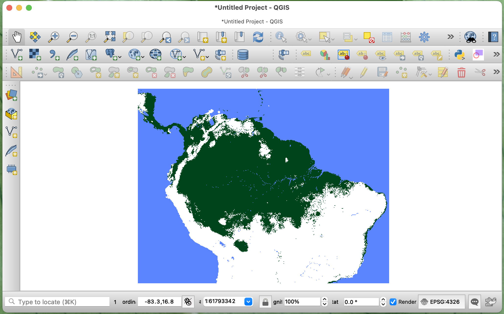
<figcaption aria-hidden="true">Figure 11. Potential distribution of <em>Bradypus variegatus</em> calculated using a custom threshold. The final map was exported to Google Drive and displayed using QGIS.</figcaption>
</figure>

### Exporting results

Here, we present code to export the final probability maps as well as the accuracy metrics, training and validation data sets used for each model. Note that there are other options to export data in GEE (see the <https://developers.google.com/earth-engine/guides/exporting/>(user guide) for other ways to export data).

```{js, eval=F}
//////////////////////////////////////////////////////
// Section 9 - Export outputs
//////////////////////////////////////////////////////

// Export final model predictions to drive

// Averaged habitat suitability
Export.image.toDrive({
  image: ModelAverage, //Object to export
  description: 'HSI', //Name of the file
  scale: GrainSize, //Spatial resolution of the exported raster
  maxPixels: 1e10,
  region: AOI //Area of interest
});

// Export final binary model based on a mayority vote
Export.image.toDrive({
  image: DistributionMap, //Object to export
  description: 'PotentialDistribution', //Name of the file
  scale: GrainSize, //Spatial resolution of the exported raster
  maxPixels: 1e10,
  region: AOI //Area of interest
});

// Export final binary model based on the threshold that maximises the sum of specificity and sensitivity
Export.image.toDrive({
  image: DistributionMap2.unmask(-9999),
  description: 'PotentialDistributionThreshold',
  scale: GrainSize,
  maxPixels: 1e10,
  region: AOI
});


// Export Accuracy Assessment Metrics

Export.table.toDrive({
  collection: ee.FeatureCollection(AUCROCs
                        .map(function(element){
                        return ee.Feature(null,{AUCROC:element})})),
  description: 'AUCROC',
  fileFormat: 'CSV',
});

Export.table.toDrive({
  collection: ee.FeatureCollection(AUCPRs
                        .map(function(element){
                        return ee.Feature(null,{AUCPR:element})})),
  description: 'AUCPR',
  fileFormat: 'CSV',
});

Export.table.toDrive({
  collection: ee.FeatureCollection(Metrics),
  description: 'Metrics',
  fileFormat: 'CSV',
});

// Export training and validation data sets

// Extract training datasets
var TrainingDatasets = ee.List.sequence(1,ee.Number(numiter).multiply(4).subtract(1),4).map(function(x){
  return results.get(x)});

// If you are interested in exporting any of the training or testing datasets used for modeling,
// you need to extract the feature collections from the SDM output list and export them.
// Here is an example for exporting the training and validation data sets from the first iteration. 
// For other iterations you need to change the number in the get function. In JavaScript the first element of the list is indexed by 0.

Export.table.toDrive({
  collection: TrainingDatasets.get(0),
  description: 'TestingDataRun1',
  fileFormat: 'CSV',
});

Export.table.toDrive({
  collection: TestingDatasets.get(0),
  description: 'TestingDataRun1',
  fileFormat: 'CSV',
});
/*
*/
```

#### References

Araújo, M. B., Anderson, R. P., Barbosa, A. M., Beale, C. M., Dormann, C. F., Early, R., Garcia, R. A., Guisan, A., Maioran, L., Naimi, B., O’Hara, R. B., Zimmermann, N. E., & Rahbek, C. (2019). Standards for distribution models in biodiversity assessments. Science Advances, 5(1), 1–12. <https://doi.org/10.1126/sciadv.aat4858>

Barbet-Massin, M., Jiguet, F., Albert, C. H., & Thuiller, W. (2012). Selecting pseudo-absences for species distribution models: How, where and how many? Methods in Ecology and Evolution, 3(2), 327–338. <https://doi.org/10.1111/j.2041-210X.2011.00172.x>

Chefaoui, R. M., & Lobo, J. M. (2008). Assessing the effects of pseudo-absences on predictive distribution model performance. Ecological Modelling, 210(4), 478–486.
<https://doi.org/10.1016/j.ecolmodel.2007.08.010>

Evans, J. S., Murphy, M. A., Holden, Z. A., & Cushman, S. A. (2011). Modeling Species Distribution and Change Using Random Forest. In C. A. Drew, Y. F. Wiersma, & F. Huettmann (Eds.), Predictive Species and Habitat Modeling in Landscape Ecology: Concepts and Applications (pp. 139–159). New York, NY: Springer New York.
<https://doi.org/10.1007/978-1-4419-7390-0_8>

Farr, T. G., Rosen, P. A., Caro, E., Crippen, R., Duren, R., Hensley, S., Kobrick, M., Paller, M., Rodriguez, E., Roth, L., Seal, D., Shaffer, S., Shimada, J., Umland, J., Werner, M., Oskin, M., Burbank, D., & Alsdorf, D. (2007). The shuttle radar topography mission. Reviews of Geophysics, 45(2), RG2004. <https://doi.org/10.1029/2005RG000183>

Fielding, A. H., & Bell, J. F. (1997). A review of methods for the assessment of prediction errors in conservation presence/absence models. Environmental Conservation, 24(1), 38–49. <https://doi.org/10.1017/S0376892997000088>

Guisan, A., Thuiller, W., & Zimmermann, N. (2017). Habitat Suitability and Distribution Models: With Applications in R. Cambridge, UK.: Cambridge University Press. <https://doi.org/doi:10.1017/9781139028271>

Hijmans, R.J., Cameron, S.E., Parra, J.L., Jones, P.G., & Jarvis, A. (2005). Very High Resolution Interpolated Climate Surfaces for Global Land Areas. International Journal of Climatology 25: 1965-1978.

Hijmans, R. J., Phillips, S., Leathwick, J., & Elith, J. (2017). dismo: Species distribution modeling. R package version 1.1-4.

Kindt, R. (2018). Ensemble species distribution modelling with transformed suitability values. Environmental Modelling and Software, 100, 136–145. <https://doi.org/10.1016/j.envsoft.2017.11.009>

Leroy, B., Delsol, R., Hugueny, B., Meynard, C. N., Barhoumi, C., Barbet-Massin, M., & Bellard, C. (2018). Without quality presence–absence data, discrimination metrics such as TSS can be misleading measures of model performance. Journal of Biogeography,
45(9), 1994–2002. <https://doi.org/10.1111/jbi.13402>

Liu, C., Newell, G., & White, M. (2016). On the selection of thresholds for predicting species occurrence with presence-only data. Ecology and Evolution, 6(1), 337–348. <https://doi.org/10.1002/ece3.1878>

Marmion, M., Parviainen, M., Luoto, M., Heikkinen, R. K., & Thuiller, W. (2009). Evaluation of consensus methods in predictive species distribution modelling. Diversity and Distributions, 15(1), 59–69. <https://doi.org/10.1111/j.1472-4642.2008.00491.x>

Mittermeier, R. A., Rylands, A. B., & Wilson, D. E., (Eds.). (2013). Handbook of the Mammals of the World: Volume 3, Primates. Barcelona, Spain.: Linx Ediciones.

Phillips, S. J., Anderson, R. P., Dudík, M., Schapire, R. E., & Blair, M. E. (2017). Opening the black box: an open-source release of Maxent. Ecography, 40(7), 887–893. <https://doi.org/10.1111/ecog.03049>

Phillips, S. J., Anderson, R. P., & Schapire, R. E. (2006). Maximum entropy modeling of species geographic distributions. Ecological Modelling, 190(3–4), 231–259.
<https://doi.org/10.1016/j.ecolmodel.2005.03.026>

Phillips, S. J., Dudík, M., Elith, J., Graham, C. H., Lehmann, A., Leathwick, J., & Ferrier, S. (2009). Sample selection bias and presence-only distribution models: Implications for background and pseudo-absence data. Ecological Applications, 19(1), 181–197. <https://doi.org/10.1890/07-2153.1>

Roberts, D. R., Bahn, V., Ciuti, S., Boyce, M. S., Elith, J., Guillera-Arroita, G., Hauenstein, S., Lahoz-Monford, J. J., Schröder, B., Thuiller, W., Warton, D. I., Wintle, B. A., Hartig, F., & Dormann, C. F. (2017). Cross-validation strategies for data with temporal, spatial, hierarchical, or phylogenetic structure. Ecography, 40(8),
913–929. <https://doi.org/10.1111/ecog.02881>

Senay, S. D., Worner, S. P., & Ikeda, T. (2013). Novel Three-Step Pseudo-Absence Selection Technique for Improved Species Distribution Modelling. PLoS ONE, 8(8).
<https://doi.org/10.1371/journal.pone.0071218>

Sillero, N., Arenas-Castro, S., Enriquez‐Urzelai, U., Vale, C. G., Sousa-Guedes, D., Martínez-Freiría, F., … Barbosa, A. M. (2021). Want to model a species niche? A step-by-step guideline on correlative ecological niche modelling. Ecological Modelling, 456. <https://doi.org/10.1016/j.ecolmodel.2021.109671>

Sofaer, H. R., Hoeting, J. A., & Jarnevich, C. S. (2019). The area under the precision-recall curve as a performance metric for rare binary events. Methods in Ecology and Evolution, 10(4), 565–577. <https://doi.org/10.1111/2041-210X.13140>

Valavi, R., Elith, J., Lahoz-Monfort, J. J., & Guillera-Arroita, G. (2019). blockCV: An r package for generating spatially or environmentally separated folds for k-fold cross-validation of species distribution models. Methods in Ecology and Evolution, 10(2), 225–232. <https://doi.org/10.1111/2041-210X.13107>

---

### Assignment 4

The goal of this assignment is to practice modifying the general workflow we presented for implementing species distribution models in [GEE](https://earthengine.google.com/). 

**Activity 1  [Easy to moderate]**
Modify the general workflow presented to fit a simple SDM using presence-only data, similar to the model we saw for Plain zebras. 

You have the option to either, download data from GBIF, use your own data, or use an species available at the following asset:  `users/ramirocrego84/Perissodactyla`. Note that this asset includes many species in the order Perissodactila, so you need to filter the data to retain only an species of interest.

The species available are: 

'Malayan tapir': "Acrocodia indica",   
'White rhinoceros': "Ceratotherium simum",  
'Black rhinoceros': "Diceros bicornis",     
'Donkey': "Equus asinus",    
'Horse': "Equus caballus",       
'Wild horse': "Equus ferus",      
'Grevy`s zebra': "Equus grevyi",         
'Hartmann`s mountain zebra': "Equus hartmannae",    
'Onager': "Equus hemionus",    
'Indian wild ass': "Equus khur",      
'Kiang': "Equus kiang",          
'Przewalski`s horse': "Equus przewalskii",   
'Plains zebra': "Equus quagga",   
'Mountain zebra': "Equus zebra",        
'Indian rhinoceros': "Rhinoceros unicornis", 
'Baird`s tapir': "Tapirella bairdii",
'Mountain tapir': "Tapirus pinchaque",   
'South American tapir': "Tapirus terrestris"


The model needs to include the following:
- Grain size: 5000 m

- Study area: decide whether you want to use the default settings or define your own. This will depend on the presence data you are using.

- Predictor variables: You will need to use predictor variables that are ecological meaningful to the species you are working with. Some options could be: elevation, slope, temperature seasonality, max temperature of warmest month, min temperature of coldest month, mean annual precipitation, mean NDVI from MODIS (MODIS/061/MOD13A2), and human modification index (CSP/HM/GlobalHumanModification)

- Create pseudo-absences randomly within the area of interest (option 1 from the tutorial)

Solutions code by clicking [here](https://code.earthengine.google.com/5fb63d2728e910270784f30314295dd0)

**Activity 2 [Advanced]**
Modify the previous model to:
- Use the country of Kenya as your area of interest (Make sure you extract the geometry)

- Define area to create pseudo-absences using option 3 (clusters).

- Define a 1000m grain size

- Adjust the block sizes for cross validation

Solutions code by clicking [here](https://code.earthengine.google.com/9525b774728fdc3344236652d27714eb)

Discussion: Are the predictor variables appropriate? What should be changed?

---
